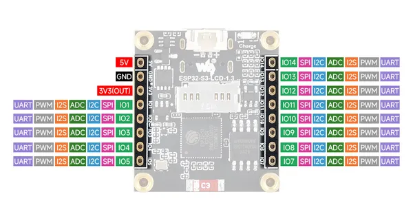

# ESP32-S3-LCD-1.3

**Waveshare** · ESP32-S3

Revision: Not identified  
Coverage: Pinout image collected

[Browse all manufacturers](../../../../BROWSE.md) · [Desktop app](https://github.com/valleytechsolutions/black-wire-desktop)

## Pinout

**pinout image** · Reviewed source · JPG

[Open original reference](../../../../library/media/7770c8b1d1d93cbb7a70c5d530be703a5a8f0e3740cab10ed287b7fd9194be87.jpg)

**Credit and rights:** Not recorded; retain original attribution. Source/manufacturer: Waveshare.

[Source 1](https://www.waveshare.com/img/devkit/ESP32-S3-LCD-1.3/ESP32-S3-LCD-1.3-details-7.jpg) · [Source 2](https://www.waveshare.com/esp32-s3-lcd-1.3.htm)

SHA-256: `7770c8b1d1d93cbb7a70c5d530be703a5a8f0e3740cab10ed287b7fd9194be87`

Pin assignments have not been independently electrically verified. Check board revision before wiring.
