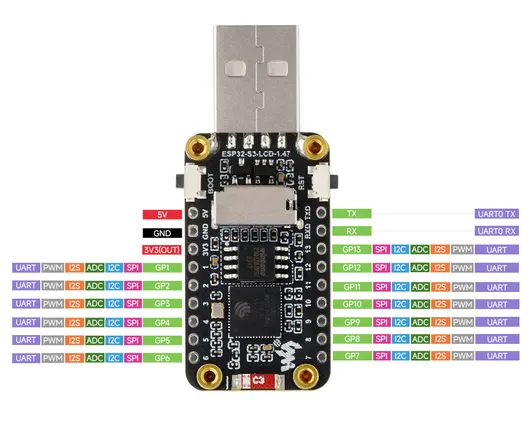

# ESP32-S3-LCD-1.47

**Waveshare** · ESP32-S3

Revision: Not identified  
Coverage: Pinout image collected

[Browse all manufacturers](../../../../BROWSE.md) · [Desktop app](https://github.com/valleytechsolutions/black-wire-desktop)

## Pinout

**pinout image** · Reviewed source · JPG

[Open original reference](../../../../library/media/277a296f345ce7e2f9d119e4a987e9503c998bfc6de6d823db8f4c9c8dd60409.jpg)

**Credit and rights:** Not recorded; retain original attribution. Source/manufacturer: Waveshare.

[Source 1](https://www.waveshare.com/img/devkit/ESP32-S3-LCD-1.47/ESP32-S3-LCD-1.47-details-9.jpg) · [Source 2](https://www.waveshare.com/esp32-s3-lcd-1.47.htm) · [Source 3](https://www.waveshare.com/wiki/ESP32-S3-LCD-1.47)

SHA-256: `277a296f345ce7e2f9d119e4a987e9503c998bfc6de6d823db8f4c9c8dd60409`

Pin assignments have not been independently electrically verified. Check board revision before wiring.
