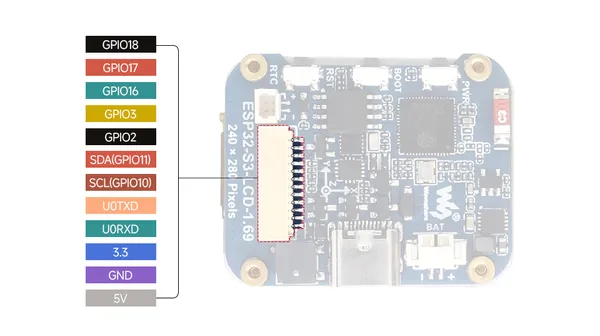
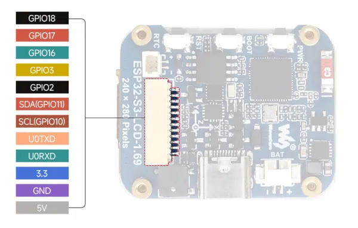

# ESP32-S3-LCD-1.69

**Waveshare** · ESP32-S3

Revision: Not identified  
Coverage: Pinout image collected

[Browse all manufacturers](../../../../BROWSE.md) · [Desktop app](https://github.com/valleytechsolutions/black-wire-desktop)

## Pinout

**pinout image** · Reviewed source · JPG

[Open original reference](../../../../library/media/c85b90a42778bff9208c3f4ddc4c00701d527903b56156eea35a13a85353f262.jpg)

**Credit and rights:** Not recorded; retain original attribution. Source/manufacturer: Waveshare.

[Source 1](https://www.waveshare.com/img/devkit/ESP32-S3-LCD-1.69/ESP32-S3-LCD-1.69-details-inter.jpg) · [Source 2](https://www.waveshare.com/esp32-s3-lcd-1.69.htm)

SHA-256: `c85b90a42778bff9208c3f4ddc4c00701d527903b56156eea35a13a85353f262`

## Pinout

**pinout image** · Reviewed source · PNG

[Open original reference](../../../../library/media/dbc59db51f63b8ab833f40c99d70946dda1cc7def8ba8dc432758ab2416d0c4b.png)

**Credit and rights:** Not recorded; retain original attribution. Source/manufacturer: Waveshare.

[Source 1](https://www.waveshare.com/w/upload/4/44/ESP32-S3-LCD-1.69_240718_001.png) · [Source 2](https://www.waveshare.com/wiki/ESP32-S3-LCD-1.69)

SHA-256: `dbc59db51f63b8ab833f40c99d70946dda1cc7def8ba8dc432758ab2416d0c4b`

Pin assignments have not been independently electrically verified. Check board revision before wiring.
