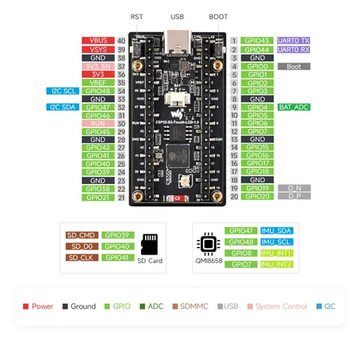

# ESP32-S3-LCD-1.9

**Waveshare** · ESP32-S3

Revision: Not identified  
Coverage: Pinout image collected

[Browse all manufacturers](../../../../BROWSE.md) · [Desktop app](https://github.com/valleytechsolutions/black-wire-desktop)

## Pinout

**pinout image** · Reviewed source · JPG

[Open original reference](../../../../library/media/27aa5506ba33a1118d5d68cd9f3858b4c8dbe75f45853bf100968c823ec0fc27.jpg)

**Credit and rights:** Not recorded; retain original attribution. Source/manufacturer: Waveshare.

[Source 1](https://www.waveshare.com/img/devkit/ESP32-S3-LCD-1.9/ESP32-S3-LCD-1.9-details-inter.jpg) · [Source 2](https://www.waveshare.com/esp32-s3-lcd-1.9.htm)

SHA-256: `27aa5506ba33a1118d5d68cd9f3858b4c8dbe75f45853bf100968c823ec0fc27`

Pin assignments have not been independently electrically verified. Check board revision before wiring.
