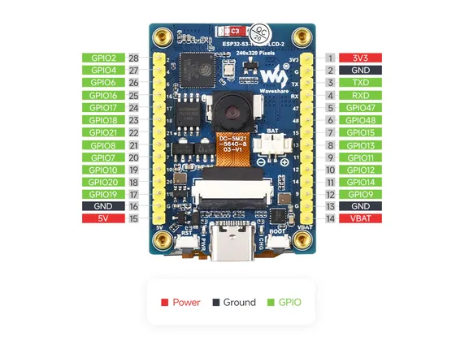
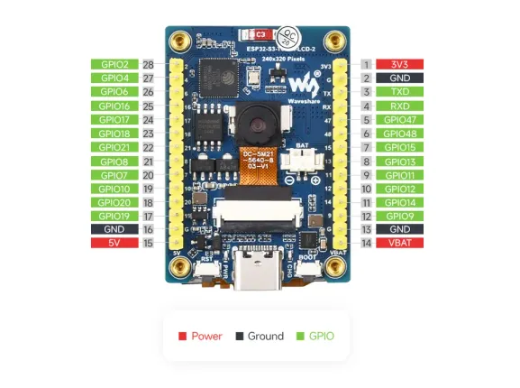
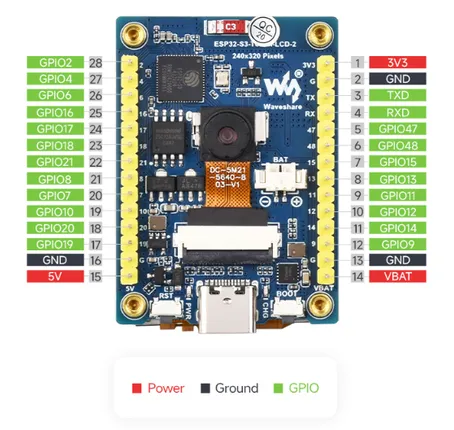

# ESP32-S3-LCD-2

**Waveshare** · ESP32-S3

Revision: Not identified  
Coverage: Pinout image collected

[Browse all manufacturers](../../../../BROWSE.md) · [Desktop app](https://github.com/valleytechsolutions/black-wire-desktop)

## Pinout

**pinout image** · Reviewed source · JPG

[Open original reference](../../../../library/media/f9a6a5b4cdc493f7abd966497b9b9eb3323bf6dc770ea76fcf71683a882b65a7.jpg)

**Credit and rights:** Not recorded; retain original attribution. Source/manufacturer: Waveshare.

[Source 1](https://www.waveshare.com/img/devkit/ESP32-S3-LCD-2/ESP32-S3-LCD-2-details-inter.jpg) · [Source 2](https://www.waveshare.com/esp32-s3-lcd-2.htm)

SHA-256: `f9a6a5b4cdc493f7abd966497b9b9eb3323bf6dc770ea76fcf71683a882b65a7`

## Pinout

**pinout image** · Reviewed source · WEBP

[Open original reference](../../../../library/media/8d60e522d17fd4ff229bd49117acca31b61e198e17afda69b9cdd7ae168f47ee.webp)

**Credit and rights:** Not recorded; retain original attribution. Source/manufacturer: Waveshare.

[Source 1](https://docs.waveshare.com/assets/images/ESP32-S3-LCD-2-details-inter-39c4313136c66a1cb1a3c1ca4265a332.webp) · [Source 2](https://docs.waveshare.com/ESP32-S3-LCD-2)

SHA-256: `8d60e522d17fd4ff229bd49117acca31b61e198e17afda69b9cdd7ae168f47ee`

## Pinout

**pinout image** · Reviewed source · PNG

[Open original reference](../../../../library/media/27e6bde491d5d14bc9c2265525f71f3985f2765a5bf15a586027be4d25d5f684.png)

**Credit and rights:** Not recorded; retain original attribution. Source/manufacturer: Waveshare.

[Source 1](https://www.waveshare.com/w/upload/e/e3/ESP32-S3-LCD-2-details-inter.png) · [Source 2](https://www.waveshare.com/wiki/ESP32-S3-LCD-2)

SHA-256: `27e6bde491d5d14bc9c2265525f71f3985f2765a5bf15a586027be4d25d5f684`

Pin assignments have not been independently electrically verified. Check board revision before wiring.
