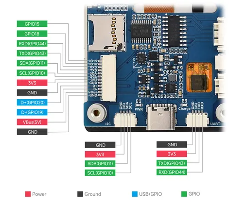

# ESP32-S3-LCD-2.8

**Waveshare** · ESP32-S3

Revision: Not identified

Coverage: Pinout image collected

[Browse all manufacturers](../../../../BROWSE.md) · [Devices & IoT](../../../../DEVICES.md) · [Open in the browser guide](https://valleytech-black-wire-guide.pages.dev/?board=waveshare-esp32-esp32-s3-lcd-2-8)

## Datasheets and original documentation

Board datasheet: **not yet recorded**. Visual reference: **available**.

[Manufacturer source (recorded link)](https://www.waveshare.com/esp32-s3-touch-lcd-2.8.htm)

A chip datasheet, schematic and board datasheet have different scopes. Match the exact hardware revision.

[Documentation coverage and remaining gaps](../../../../DOCUMENTATION.md)

## Pinout

**pinout image** · Reviewed source · JPG

[Open original reference](../../../../library/media/32ebf7242c9c4d21625b7200b99678e635c97620ba6dcac4a9bb20b3e32dfbfc.jpg)

**Credit and rights:** Not recorded; retain original attribution. Source/manufacturer: Waveshare.

[Source 1](https://www.waveshare.com/img/devkit/ESP32-S3-Touch-LCD-2.8/ESP32-S3-Touch-LCD-2.8-details-7.jpg) · [Source 2](https://www.waveshare.com/esp32-s3-touch-lcd-2.8.htm)

Image revision: Not identified

SHA-256: `32ebf7242c9c4d21625b7200b99678e635c97620ba6dcac4a9bb20b3e32dfbfc`

## Pinout

**pinout image** · Reviewed source · PNG

[Open original reference](../../../../library/media/9f6f1d7c4ac21139bd0cb3b19024e4a5ee02b5e1d50d11b78d17bfb0c0b50401.png)

**Credit and rights:** Not recorded; retain original attribution. Source/manufacturer: Waveshare.

[Source 1](https://www.waveshare.com/w/upload/0/06/ESP32-S3-Touch-LCD-2.8-2.png) · [Source 2](https://www.waveshare.com/wiki/ESP32-S3-LCD-2.8) · [Source 3](https://www.waveshare.com/wiki/ESP32-S3-Touch-LCD-2.8)

Image revision: Not identified

SHA-256: `9f6f1d7c4ac21139bd0cb3b19024e4a5ee02b5e1d50d11b78d17bfb0c0b50401`

Pin assignments have not been independently electrically verified. Check board revision before wiring.
