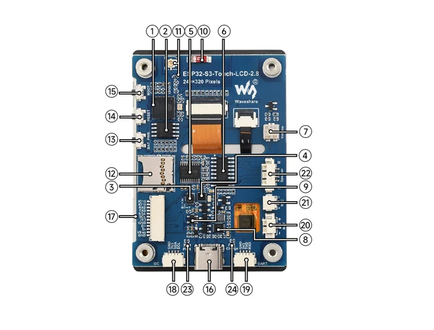
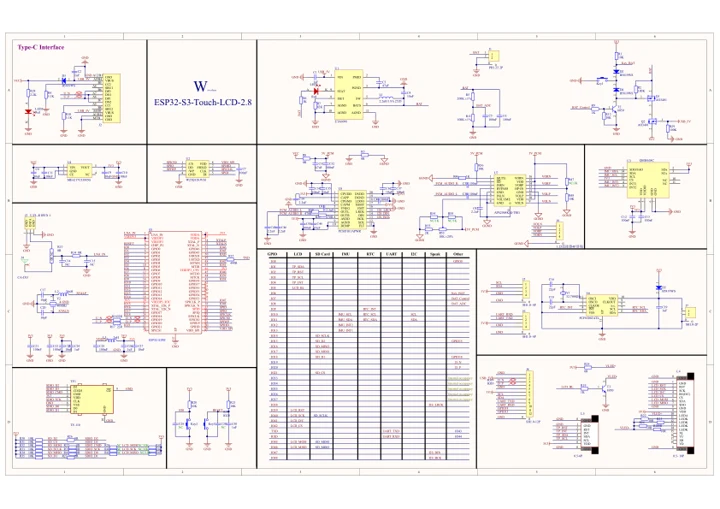

# ESP32-S3-LCD-2.8

**Waveshare** · ESP32-S3

Revision: Not identified

Coverage: Manufacturer references reviewed by scope; independent electrical and all-connector review pending

[Browse all manufacturers](../../../../BROWSE.md) · [Devices & IoT](../../../../DEVICES.md) · [Open in the browser guide](https://valleytech-black-wire-guide.pages.dev/?board=waveshare-esp32-esp32-s3-lcd-2-8)

## Datasheets and original documentation

Board datasheet: **not yet recorded**. Visual reference: **available**.

[Manufacturer hardware documentation](https://www.waveshare.com/wiki/ESP32-S3-Touch-LCD-2.8)

- **schematic / recorded-source**: [ESP32-S3-Touch-LCD-2.8 Schematic diagram](https://files.waveshare.com/wiki/ESP32-S3-Touch-LCD-2.8/ESP32-S3-Touch-LCD-2.8.pdf) · [saved document](../../../../library/media/ff9b842b8254e4045c2824f449e0c259f76c3b8658d3ec359f288e458a833c88.pdf)
- **hardware-guide / board**: [Manufacturer pin and hardware documentation](https://www.waveshare.com/wiki/ESP32-S3-Touch-LCD-2.8) · online

A chip datasheet, schematic and board datasheet have different scopes. Match the exact hardware revision.

[Documentation coverage and remaining gaps](../../../../DOCUMENTATION.md)

## Pinout

**pinout image** · Reviewed source · JPG

[Open original reference](../../../../library/media/32ebf7242c9c4d21625b7200b99678e635c97620ba6dcac4a9bb20b3e32dfbfc.jpg)

**Credit and rights:** Not recorded; retain original attribution. Source/manufacturer: Waveshare.

[Source 1](https://www.waveshare.com/img/devkit/ESP32-S3-Touch-LCD-2.8/ESP32-S3-Touch-LCD-2.8-details-7.jpg) · [Source 2](https://www.waveshare.com/esp32-s3-touch-lcd-2.8.htm)

Image revision: Not identified

SHA-256: `32ebf7242c9c4d21625b7200b99678e635c97620ba6dcac4a9bb20b3e32dfbfc`

## Pinout

**pinout image** · Reviewed source · PNG

[Open original reference](../../../../library/media/9f6f1d7c4ac21139bd0cb3b19024e4a5ee02b5e1d50d11b78d17bfb0c0b50401.png)

**Credit and rights:** Not recorded; retain original attribution. Source/manufacturer: Waveshare.

[Source 1](https://www.waveshare.com/w/upload/0/06/ESP32-S3-Touch-LCD-2.8-2.png) · [Source 2](https://www.waveshare.com/wiki/ESP32-S3-LCD-2.8) · [Source 3](https://www.waveshare.com/wiki/ESP32-S3-Touch-LCD-2.8)

Image revision: Not identified

SHA-256: `9f6f1d7c4ac21139bd0cb3b19024e4a5ee02b5e1d50d11b78d17bfb0c0b50401`

## Onboard Resources

**board labeling image** · Source identity and visual scope inspected; PDF review covers first-page preview. Independent electrical and all-connector completeness review pending. · PNG

[Open original reference](../../../../library/media/2b528d12387e0085f1941e5f852ea18baa8a5879bf063f9a6b0a9a34060f3aa8.png)

**Credit and rights:** Manufacturer artwork; reuse and print rights not established. Inclusion does not relicense the original.. Source/manufacturer: Waveshare.

[Source 1](https://www.waveshare.com/w/upload/d/d9/ESP32-S3-Touch-LCD-2.8-introduction-02.png) · [Source 2](https://www.waveshare.com/wiki/ESP32-S3-Touch-LCD-2.8)

Manufacturer source retained unchanged. Source identity and visual scope inspected; PDF review covers first-page preview. Independent electrical and all-connector completeness review pending. See the linked manufacturer page for the numbered component legend. This is not a complete physical pinout.

Image revision: As supplied in the original; match exact board revision

SHA-256: `2b528d12387e0085f1941e5f852ea18baa8a5879bf063f9a6b0a9a34060f3aa8`

## ESP32-S3-Touch-LCD-2.8 Schematic diagram

**original reference PDF** · Source identity and visual scope inspected; PDF review covers first-page preview. Independent electrical and all-connector completeness review pending. · PDF

[Open original reference](../../../../library/media/ff9b842b8254e4045c2824f449e0c259f76c3b8658d3ec359f288e458a833c88.pdf)

**Credit and rights:** Manufacturer artwork; reuse and print rights not established. Inclusion does not relicense the original.. Source/manufacturer: Waveshare.

[Source 1](https://files.waveshare.com/wiki/ESP32-S3-Touch-LCD-2.8/ESP32-S3-Touch-LCD-2.8.pdf) · [Source 2](https://www.waveshare.com/wiki/ESP32-S3-Touch-LCD-2.8)

Manufacturer source retained unchanged. Source identity and visual scope inspected; PDF review covers first-page preview. Independent electrical and all-connector completeness review pending.

Image revision: As supplied in the original; match exact board revision

SHA-256: `ff9b842b8254e4045c2824f449e0c259f76c3b8658d3ec359f288e458a833c88`

Pin assignments have not been independently electrically verified. Check board revision before wiring.
