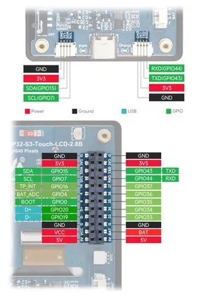

# ESP32-S3-LCD-2.8B

**Waveshare** · ESP32-S3

Revision: Not identified  
Coverage: Pinout image collected

[Browse all manufacturers](../../../../BROWSE.md) · [Desktop app](https://github.com/valleytechsolutions/black-wire-desktop)

## Pinout

**pinout image** · Reviewed source · JPG

[Open original reference](../../../../library/media/0df8d181ed0a035146d9d3b37e2d26253a9ce88834b4edf813dd4b0892295494.jpg)

**Credit and rights:** Not recorded; retain original attribution. Source/manufacturer: Waveshare.

[Source 1](https://www.waveshare.com/w/upload/3/3e/600px-ESP32-S3-LCD-2.8B-introduction-05.jpg) · [Source 2](https://www.waveshare.com/wiki/ESP32-S3-LCD-2.8B)

SHA-256: `0df8d181ed0a035146d9d3b37e2d26253a9ce88834b4edf813dd4b0892295494`

Pin assignments have not been independently electrically verified. Check board revision before wiring.
