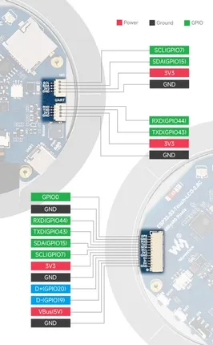

# ESP32-S3-LCD-2.8C

**Waveshare** · ESP32-S3

Revision: Not identified  
Coverage: Pinout image collected

[Browse all manufacturers](../../../../BROWSE.md) · [Desktop app](https://github.com/valleytechsolutions/black-wire-desktop)

## Pinout

**pinout image** · Reviewed source · JPG

[Open original reference](../../../../library/media/028e628364573ab7083c9ff2b6f1ec18e530cfce6440e225f4f3b1c8cae93349.jpg)

**Credit and rights:** Not recorded; retain original attribution. Source/manufacturer: Waveshare.

[Source 1](https://www.waveshare.com/w/upload/4/47/600px-ESP32-S3-Touch-LCD-2.8C-introduction-02.jpg) · [Source 2](https://www.waveshare.com/wiki/ESP32-S3-LCD-2.8C) · [Source 3](https://www.waveshare.com/wiki/ESP32-S3-Touch-LCD-2.8C)

SHA-256: `028e628364573ab7083c9ff2b6f1ec18e530cfce6440e225f4f3b1c8cae93349`

Pin assignments have not been independently electrically verified. Check board revision before wiring.
