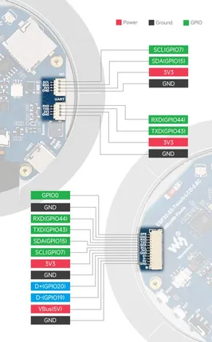

# ESP32-S3-LCD-2.8C

**Waveshare** · ESP32-S3

Revision: Not identified

Coverage: Pinout image collected

[Browse all manufacturers](../../../../BROWSE.md) · [Devices & IoT](../../../../DEVICES.md) · [Open in the browser guide](https://valleytech-black-wire-guide.pages.dev/?board=waveshare-esp32-esp32-s3-lcd-2-8c)

## Datasheets and original documentation

Board datasheet: **not yet recorded**. Visual reference: **available**.

[Manufacturer source (recorded link)](https://www.waveshare.com/wiki/ESP32-S3-LCD-2.8C)

A chip datasheet, schematic and board datasheet have different scopes. Match the exact hardware revision.

[Documentation coverage and remaining gaps](../../../../DOCUMENTATION.md)

## Pinout

**pinout image** · Reviewed source · JPG

[Open original reference](../../../../library/media/028e628364573ab7083c9ff2b6f1ec18e530cfce6440e225f4f3b1c8cae93349.jpg)

**Credit and rights:** Not recorded; retain original attribution. Source/manufacturer: Waveshare.

[Source 1](https://www.waveshare.com/w/upload/4/47/600px-ESP32-S3-Touch-LCD-2.8C-introduction-02.jpg) · [Source 2](https://www.waveshare.com/wiki/ESP32-S3-LCD-2.8C) · [Source 3](https://www.waveshare.com/wiki/ESP32-S3-Touch-LCD-2.8C)

Image revision: Not identified

SHA-256: `028e628364573ab7083c9ff2b6f1ec18e530cfce6440e225f4f3b1c8cae93349`

Pin assignments have not been independently electrically verified. Check board revision before wiring.
