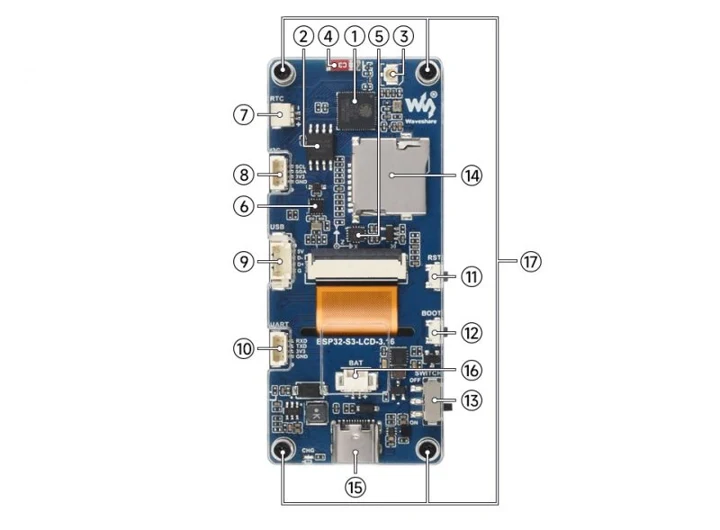
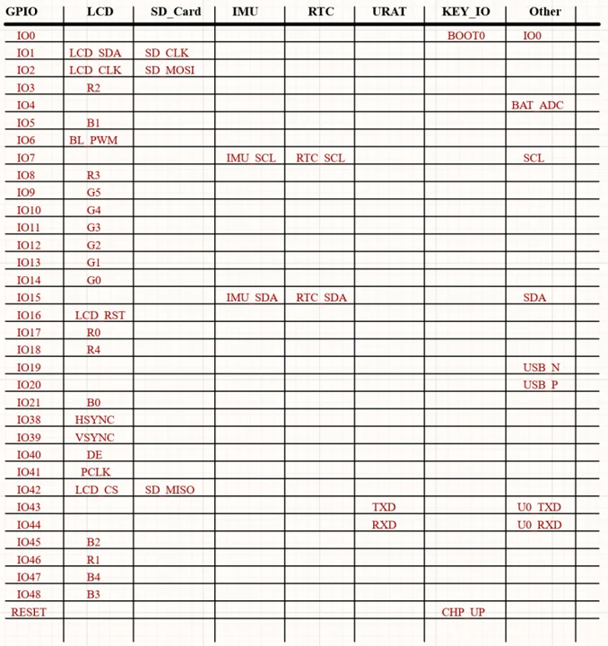
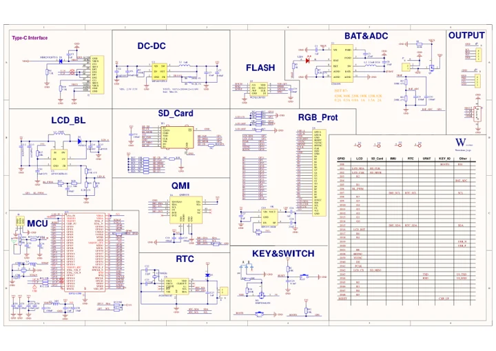
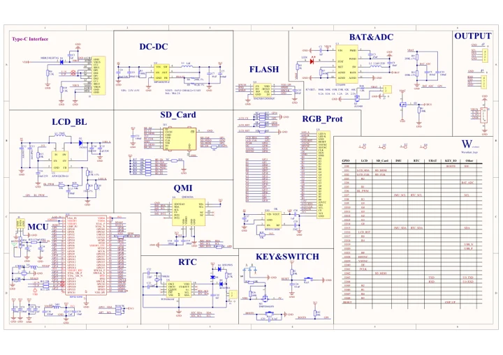

# ESP32-S3-LCD-3.16

**Waveshare** · ESP32-S3

Revision: Not identified

Coverage: Manufacturer references reviewed by scope; independent electrical and all-connector review pending

[Browse all manufacturers](../../../../BROWSE.md) · [Devices & IoT](../../../../DEVICES.md) · [Open in the browser guide](https://valleytech-black-wire-guide.pages.dev/?board=waveshare-esp32-esp32-s3-lcd-3-16)

## Datasheets and original documentation

Board datasheet: **not yet recorded**. Visual reference: **available**.

[Manufacturer hardware documentation](https://www.waveshare.com/wiki/ESP32-S3-LCD-3.16)

- **schematic / board**: [ESP32-S3-LCD-3.16 V1 Schematic diagram](https://files.waveshare.com/wiki/ESP32-S3-LCD-3.16/ESP32-S3-LCD-3.16-Schematic.pdf) · [saved document](../../../../library/media/cd09f01687b9fa91a10b4623b7a82d7d63c31b746fbdbdcef9ad4418043e6018.pdf)
- **schematic / board**: [ESP32-S3-LCD-3.16 V2 Schematic diagram](https://files.waveshare.com/wiki/ESP32-S3-LCD-3.16/ESP32-S3-LCD-3.16-Rev1.1.pdf) · [saved document](../../../../library/media/8e64a379000b8c5f63b87e68f3aafdadca951c60abe8769c3fed77b7ca6ad169.pdf)
- **hardware-guide / board**: [Manufacturer pin and hardware documentation](https://www.waveshare.com/wiki/ESP32-S3-LCD-3.16) · online

A chip datasheet, schematic and board datasheet have different scopes. Match the exact hardware revision.

[Documentation coverage and remaining gaps](../../../../DOCUMENTATION.md)

## Onboard Resources

**board labeling image** · Source identity and visual scope inspected; PDF review covers first-page preview. Independent electrical and all-connector completeness review pending. · JPG

[Open original reference](../../../../library/media/5445e7fafc42793b61cfb5022288e6511900ed3ea6a71d84643c36a50ce74ce8.jpg)

**Credit and rights:** Manufacturer artwork; reuse and print rights not established. Inclusion does not relicense the original.. Source/manufacturer: Waveshare.

[Source 1](https://www.waveshare.com/w/upload/f/fe/800px-ESP32-S3-LCD-3.16-9.jpg) · [Source 2](https://www.waveshare.com/wiki/ESP32-S3-LCD-3.16)

Manufacturer source retained unchanged. Source identity and visual scope inspected; PDF review covers first-page preview. Independent electrical and all-connector completeness review pending. See the linked manufacturer page for the numbered component legend. This is not a complete physical pinout.

Image revision: As supplied in the original; match exact board revision

SHA-256: `5445e7fafc42793b61cfb5022288e6511900ed3ea6a71d84643c36a50ce74ce8`

## Interfaces

**pin function reference** · Source identity and visual scope inspected; PDF review covers first-page preview. Independent electrical and all-connector completeness review pending. · PNG

[Open original reference](../../../../library/media/359a2114e721d9d283b85a28cafb427e3e5acbe804f599b3dee75d1560b57bbc.png)

**Credit and rights:** Manufacturer artwork; reuse and print rights not established. Inclusion does not relicense the original.. Source/manufacturer: Waveshare.

[Source 1](https://www.waveshare.com/w/upload/1/1b/800px-ESP32-S3-LCD-3.16-10.png) · [Source 2](https://www.waveshare.com/wiki/ESP32-S3-LCD-3.16)

Manufacturer source retained unchanged. Source identity and visual scope inspected; PDF review covers first-page preview. Independent electrical and all-connector completeness review pending.

Image revision: As supplied in the original; match exact board revision

SHA-256: `359a2114e721d9d283b85a28cafb427e3e5acbe804f599b3dee75d1560b57bbc`

## ESP32-S3-LCD-3.16 V1 Schematic diagram

**original reference PDF** · Source identity and visual scope inspected; PDF review covers first-page preview. Independent electrical and all-connector completeness review pending. · PDF

[Open original reference](../../../../library/media/cd09f01687b9fa91a10b4623b7a82d7d63c31b746fbdbdcef9ad4418043e6018.pdf)

**Credit and rights:** Manufacturer artwork; reuse and print rights not established. Inclusion does not relicense the original.. Source/manufacturer: Waveshare.

[Source 1](https://files.waveshare.com/wiki/ESP32-S3-LCD-3.16/ESP32-S3-LCD-3.16-Schematic.pdf) · [Source 2](https://www.waveshare.com/wiki/ESP32-S3-LCD-3.16)

Manufacturer source retained unchanged. Source identity and visual scope inspected; PDF review covers first-page preview. Independent electrical and all-connector completeness review pending.

Image revision: As supplied in the original; match exact board revision

SHA-256: `cd09f01687b9fa91a10b4623b7a82d7d63c31b746fbdbdcef9ad4418043e6018`

## ESP32-S3-LCD-3.16 V2 Schematic diagram

**original reference PDF** · Source identity and visual scope inspected; PDF review covers first-page preview. Independent electrical and all-connector completeness review pending. · PDF

[Open original reference](../../../../library/media/8e64a379000b8c5f63b87e68f3aafdadca951c60abe8769c3fed77b7ca6ad169.pdf)

**Credit and rights:** Manufacturer artwork; reuse and print rights not established. Inclusion does not relicense the original.. Source/manufacturer: Waveshare.

[Source 1](https://files.waveshare.com/wiki/ESP32-S3-LCD-3.16/ESP32-S3-LCD-3.16-Rev1.1.pdf) · [Source 2](https://www.waveshare.com/wiki/ESP32-S3-LCD-3.16)

Manufacturer source retained unchanged. Source identity and visual scope inspected; PDF review covers first-page preview. Independent electrical and all-connector completeness review pending.

Image revision: As supplied in the original; match exact board revision

SHA-256: `8e64a379000b8c5f63b87e68f3aafdadca951c60abe8769c3fed77b7ca6ad169`

Pin assignments have not been independently electrically verified. Check board revision before wiring.
