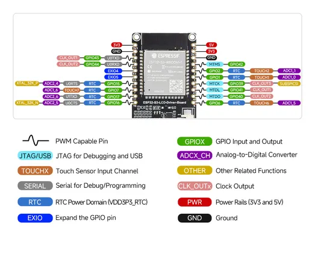
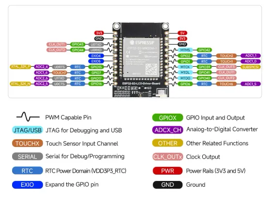

# ESP32-S3-LCD-Driver-Board

**Waveshare** · ESP32-S3

Revision: Not identified

Coverage: Pinout image collected

[Browse all manufacturers](../../../../BROWSE.md) · [Devices & IoT](../../../../DEVICES.md) · [Open in the browser guide](https://valleytech-black-wire-guide.pages.dev/?board=waveshare-esp32-esp32-s3-lcd-driver-board)

## Datasheets and original documentation

Board datasheet: **not yet recorded**. Visual reference: **available**.

[Manufacturer source (recorded link)](https://www.waveshare.com/wiki/ESP32-S3-LCD-Driver-Board)

A chip datasheet, schematic and board datasheet have different scopes. Match the exact hardware revision.

[Documentation coverage and remaining gaps](../../../../DOCUMENTATION.md)

## Pinout

**pinout image** · Reviewed source · JPG

[Open original reference](../../../../library/media/3206eab0acb989a7b2d1fd1c556f2625aaf3a446551abf40d4cef139f86f691f.jpg)

**Credit and rights:** Not recorded; retain original attribution. Source/manufacturer: Waveshare.

[Source 1](https://www.waveshare.com/w/upload/6/66/ESP32-S3-LCD-Driver-Board-details-9.jpg) · [Source 2](https://www.waveshare.com/wiki/ESP32-S3-LCD-Driver-Board)

Image revision: Not identified

SHA-256: `3206eab0acb989a7b2d1fd1c556f2625aaf3a446551abf40d4cef139f86f691f`

## Pinout

**pinout image** · Reviewed source · WEBP

[Open original reference](../../../../library/media/bc8957e56d5d5178ce89f7b68c42a030954ae14297217afa856cabfbc4952dcc.webp)

**Credit and rights:** Not recorded; retain original attribution. Source/manufacturer: Waveshare.

[Source 1](https://docs.waveshare.com/assets/images/ESP32-S3-LCD-Driver-Board_product3-b2fd3c4c1102d337b34ddbbc3b937939.webp) · [Source 2](https://docs.waveshare.com/ESP32-S3-LCD-Driver-Board)

Image revision: Not identified

SHA-256: `bc8957e56d5d5178ce89f7b68c42a030954ae14297217afa856cabfbc4952dcc`

Pin assignments have not been independently electrically verified. Check board revision before wiring.
