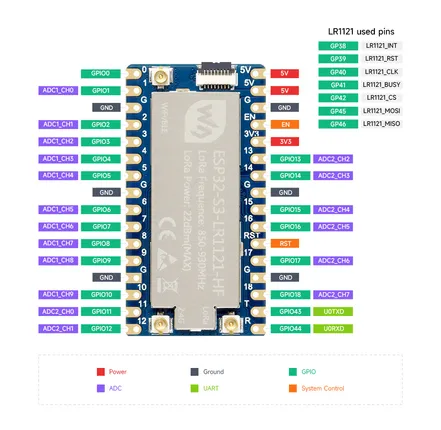

# ESP32-S3-LR1121-XF

**Waveshare** · ESP32-S3

Revision: Not identified  
Coverage: Pinout image collected

[Browse all manufacturers](../../../../BROWSE.md) · [Desktop app](https://github.com/valleytechsolutions/black-wire-desktop)

## Pinout

**pinout image** · Reviewed source · JPG

[Open original reference](../../../../library/media/95ae821190236f783680935e8332d13e756d3357b164355ea6fb8b5e97f4b7f2.jpg)

**Credit and rights:** Not recorded; retain original attribution. Source/manufacturer: Waveshare.

[Source 1](https://www.waveshare.com/img/devkit/ESP32-S3-LR1121-HF/ESP32-S3-LR1121-HF-details-inter.jpg) · [Source 2](https://www.waveshare.com/esp32-s3-lr1121.htm)

SHA-256: `95ae821190236f783680935e8332d13e756d3357b164355ea6fb8b5e97f4b7f2`

Pin assignments have not been independently electrically verified. Check board revision before wiring.
