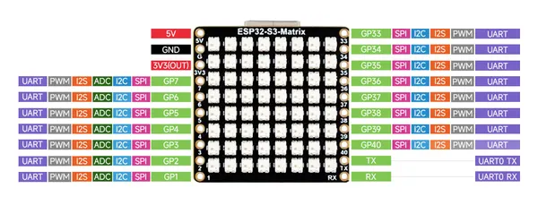
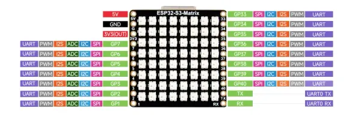

# ESP32-S3-Matrix

**Waveshare** · ESP32-S3

Revision: Not identified  
Coverage: Pinout image collected

[Browse all manufacturers](../../../../BROWSE.md) · [Desktop app](https://github.com/valleytechsolutions/black-wire-desktop)

## Pinout

**pinout image** · Reviewed source · JPG

[Open original reference](../../../../library/media/ae2a76a33e01bf0e714dfe57fde09b31a56f989c47a7cc595b2aaa67a5d62aee.jpg)

**Credit and rights:** Not recorded; retain original attribution. Source/manufacturer: Waveshare.

[Source 1](https://www.waveshare.com/img/devkit/ESP32-S3-Matrix/ESP32-S3-Matrix-details-11.jpg) · [Source 2](https://www.waveshare.com/esp32-s3-matrix.htm)

SHA-256: `ae2a76a33e01bf0e714dfe57fde09b31a56f989c47a7cc595b2aaa67a5d62aee`

## Pinout

**pinout image** · Reviewed source · WEBP

[Open original reference](../../../../library/media/d07c927f0073a3d31d68033090a07404531cb695a14345084112b2a2aaed0b21.webp)

**Credit and rights:** Not recorded; retain original attribution. Source/manufacturer: Waveshare.

[Source 1](https://docs.waveshare.com/assets/images/ESP32-S3-Matrix_entity_3-cf54a3c4c67337781e5e152ceaded125.webp) · [Source 2](https://docs.waveshare.com/ESP32-S3-Matrix)

SHA-256: `d07c927f0073a3d31d68033090a07404531cb695a14345084112b2a2aaed0b21`

## Pinout

**pinout image** · Reviewed source · PNG

[Open original reference](../../../../library/media/518f4364e97bd09f8775ab0351107d3bcc6304bedf2d5c4bf6dba079345cc0d7.png)

**Credit and rights:** Not recorded; retain original attribution. Source/manufacturer: Waveshare.

[Source 1](https://www.waveshare.com/w/upload/2/25/ESP32-S3-Matrix_OR.png) · [Source 2](https://www.waveshare.com/wiki/ESP32-S3-Matrix)

SHA-256: `518f4364e97bd09f8775ab0351107d3bcc6304bedf2d5c4bf6dba079345cc0d7`

Pin assignments have not been independently electrically verified. Check board revision before wiring.
