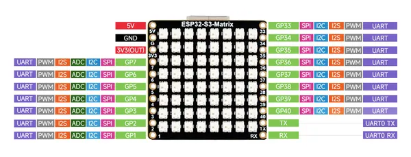
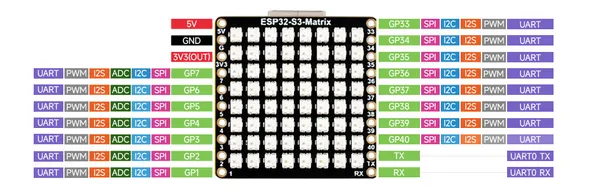

# ESP32-S3-Matrix

**Waveshare** · ESP32-S3

Revision: Not identified

Coverage: Manufacturer references reviewed by scope; independent electrical and all-connector review pending

[Browse all manufacturers](../../../../BROWSE.md) · [Devices & IoT](../../../../DEVICES.md) · [Open in the browser guide](https://valleytech-black-wire-guide.pages.dev/?board=waveshare-esp32-esp32-s3-matrix)

## Datasheets and original documentation

Board datasheet: **not yet recorded**. Visual reference: **available**.

[Manufacturer hardware documentation](https://docs.waveshare.com/ESP32-S3-Matrix)

- **schematic / board**: [ESP32-S3-Matrix Schematic](https://files.waveshare.com/wiki/ESP32-S3-Matrix/ESP32-S3-Matrix-Sch.pdf) · [saved document](../../../../library/media/ae1e41577f0efc06ad1253d079f1088421cd70775bc050f3848fe3ce1c98f120.pdf)
- **hardware-guide / board**: [Manufacturer pin and hardware documentation](https://docs.waveshare.com/ESP32-S3-Matrix) · online

A chip datasheet, schematic and board datasheet have different scopes. Match the exact hardware revision.

[Documentation coverage and remaining gaps](../../../../DOCUMENTATION.md)

## Pinout

**pinout image** · Reviewed source · JPG

[Open original reference](../../../../library/media/ae2a76a33e01bf0e714dfe57fde09b31a56f989c47a7cc595b2aaa67a5d62aee.jpg)

**Credit and rights:** Not recorded; retain original attribution. Source/manufacturer: Waveshare.

[Source 1](https://www.waveshare.com/img/devkit/ESP32-S3-Matrix/ESP32-S3-Matrix-details-11.jpg) · [Source 2](https://www.waveshare.com/esp32-s3-matrix.htm)

Image revision: Not identified

SHA-256: `ae2a76a33e01bf0e714dfe57fde09b31a56f989c47a7cc595b2aaa67a5d62aee`

## Pinout

**pinout image** · Reviewed source · WEBP

[Open original reference](../../../../library/media/d07c927f0073a3d31d68033090a07404531cb695a14345084112b2a2aaed0b21.webp)

**Credit and rights:** Not recorded; retain original attribution. Source/manufacturer: Waveshare.

[Source 1](https://docs.waveshare.com/assets/images/ESP32-S3-Matrix_entity_3-cf54a3c4c67337781e5e152ceaded125.webp) · [Source 2](https://docs.waveshare.com/ESP32-S3-Matrix)

Image revision: Not identified

SHA-256: `d07c927f0073a3d31d68033090a07404531cb695a14345084112b2a2aaed0b21`

## Pinout

**pinout image** · Reviewed source · PNG

[Open original reference](../../../../library/media/518f4364e97bd09f8775ab0351107d3bcc6304bedf2d5c4bf6dba079345cc0d7.png)

**Credit and rights:** Not recorded; retain original attribution. Source/manufacturer: Waveshare.

[Source 1](https://www.waveshare.com/w/upload/2/25/ESP32-S3-Matrix_OR.png) · [Source 2](https://www.waveshare.com/wiki/ESP32-S3-Matrix)

Image revision: Not identified

SHA-256: `518f4364e97bd09f8775ab0351107d3bcc6304bedf2d5c4bf6dba079345cc0d7`

## Onboard Resources ​

**board labeling image** · Source identity and visual scope inspected; PDF review covers first-page preview. Independent electrical and all-connector completeness review pending. · WEBP

[Open original reference](../../../../library/media/45f5ef5216efe8db76728ec7e542fb51cae970cccd961df75543df9842bdc3ce.webp)

**Credit and rights:** Manufacturer artwork; reuse and print rights not established. Inclusion does not relicense the original.. Source/manufacturer: Waveshare.

[Source 1](https://docs.waveshare.com/assets/images/ESP32-S3-Matrix_entity_2-428f0e82a4f163a365edecbc756f9176.webp) · [Source 2](https://docs.waveshare.com/ESP32-S3-Matrix)

Manufacturer source retained unchanged. Source identity and visual scope inspected; PDF review covers first-page preview. Independent electrical and all-connector completeness review pending. See the linked manufacturer page for the numbered component legend. This is not a complete physical pinout.

Image revision: As supplied in the original; match exact board revision

SHA-256: `45f5ef5216efe8db76728ec7e542fb51cae970cccd961df75543df9842bdc3ce`

## ESP32-S3-Matrix Schematic

**original reference PDF** · Source identity and visual scope inspected; PDF review covers first-page preview. Independent electrical and all-connector completeness review pending. · PDF

[Open original reference](../../../../library/media/ae1e41577f0efc06ad1253d079f1088421cd70775bc050f3848fe3ce1c98f120.pdf)

**Credit and rights:** Manufacturer artwork; reuse and print rights not established. Inclusion does not relicense the original.. Source/manufacturer: Waveshare.

[Source 1](https://files.waveshare.com/wiki/ESP32-S3-Matrix/ESP32-S3-Matrix-Sch.pdf) · [Source 2](https://docs.waveshare.com/ESP32-S3-Matrix/Resources-And-Documents)

Manufacturer source retained unchanged. Source identity and visual scope inspected; PDF review covers first-page preview. Independent electrical and all-connector completeness review pending.

Image revision: As supplied in the original; match exact board revision

SHA-256: `ae1e41577f0efc06ad1253d079f1088421cd70775bc050f3848fe3ce1c98f120`

Pin assignments have not been independently electrically verified. Check board revision before wiring.
