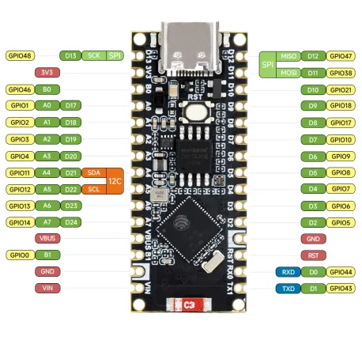
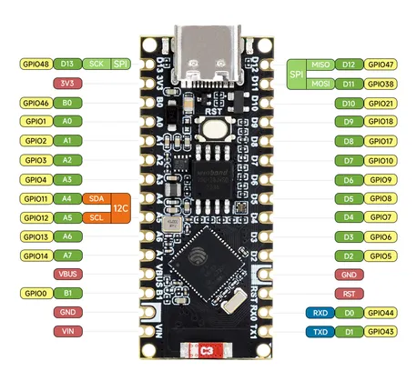

# ESP32-S3-Nano

**Waveshare** · ESP32-S3

Revision: Not identified  
Coverage: Pinout image collected

[Browse all manufacturers](../../../../BROWSE.md) · [Desktop app](https://github.com/valleytechsolutions/black-wire-desktop)

## Pinout

**pinout image** · Reviewed source · WEBP

[Open original reference](../../../../library/media/c33bb3f3f5ccb9c26f3979d3d9e80e1a0e6e840ed0f509233b46c20d48a005db.webp)

**Credit and rights:** Not recorded; retain original attribution. Source/manufacturer: Waveshare.

[Source 1](https://docs.waveshare.com/assets/images/ESP32-S3-Nano-details-inter-1-c806cf5e83bb5f6f6f71fc5bad2239c7.webp) · [Source 2](https://docs.waveshare.com/ESP32-S3-Nano)

SHA-256: `c33bb3f3f5ccb9c26f3979d3d9e80e1a0e6e840ed0f509233b46c20d48a005db`

## Pinout

**pinout image** · Reviewed source · JPG

[Open original reference](../../../../library/media/6b2b8fa57ecd4e8774f13e995d98c247f5442ba77059c5569dc6a512d9809df5.jpg)

**Credit and rights:** Not recorded; retain original attribution. Source/manufacturer: Waveshare.

[Source 1](https://www.waveshare.com/w/upload/2/2d/ESP32-S3-Nano_Version3.jpg) · [Source 2](https://www.waveshare.com/wiki/ESP32-S3-Nano) · [Source 3](https://www.waveshare.com/esp32-s3-nano.htm)

SHA-256: `6b2b8fa57ecd4e8774f13e995d98c247f5442ba77059c5569dc6a512d9809df5`

Pin assignments have not been independently electrically verified. Check board revision before wiring.
