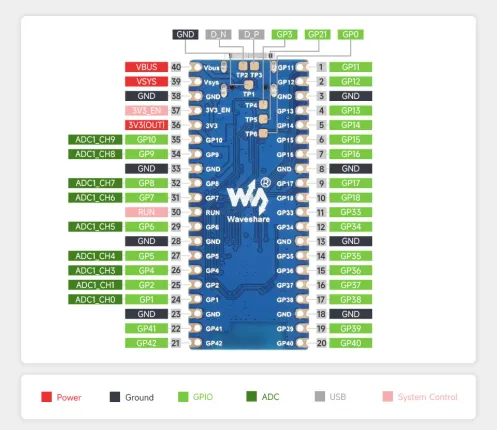

# ESP32-S3-Pico

**Waveshare** · ESP32-S3

Revision: Not identified  
Coverage: Pinout image collected

[Browse all manufacturers](../../../../BROWSE.md) · [Desktop app](https://github.com/valleytechsolutions/black-wire-desktop)

## Pinout

**pinout image** · Reviewed source · WEBP

[Open original reference](../../../../library/media/fc8a1e69c46cded150da4bc8e65ba68180529324e81f72c8b270485e57ac7b82.webp)

**Credit and rights:** Not recorded; retain original attribution. Source/manufacturer: Waveshare.

[Source 1](https://docs.waveshare.com/assets/images/ESP32-S3-Pico-details-inter-ccf703ca905565eb0ef0c703a983187d.webp) · [Source 2](https://docs.waveshare.com/ESP32-S3-Pico)

SHA-256: `fc8a1e69c46cded150da4bc8e65ba68180529324e81f72c8b270485e57ac7b82`

## Pinout

**pinout image** · Reviewed source · JPG

[Open original reference](../../../../library/media/dbe380d2eb31978d22697ccd6437dfd9de015424c994de97c4460b6217892270.jpg)

**Credit and rights:** Not recorded; retain original attribution. Source/manufacturer: Waveshare.

[Source 1](https://www.waveshare.com/w/upload/9/90/ESP32-S3-Pico-details-inter-1.jpg) · [Source 2](https://www.waveshare.com/wiki/ESP32-S3-Pico) · [Source 3](https://www.waveshare.com/esp32-s3-pico.htm)

SHA-256: `dbe380d2eb31978d22697ccd6437dfd9de015424c994de97c4460b6217892270`

Pin assignments have not been independently electrically verified. Check board revision before wiring.
