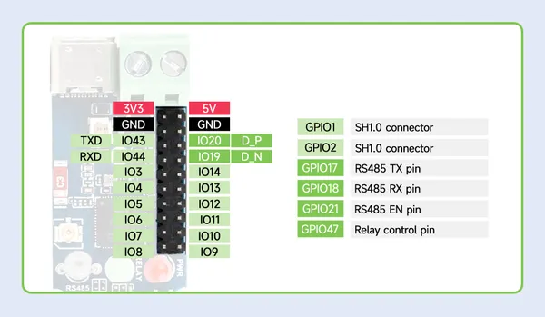
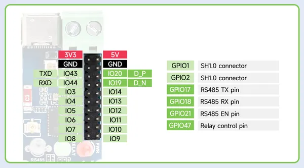

# ESP32-S3-Relay-1CH

**Waveshare** · ESP32-S3

Revision: Not identified  
Coverage: Pinout image collected

[Browse all manufacturers](../../../../BROWSE.md) · [Desktop app](https://github.com/valleytechsolutions/black-wire-desktop)

## Pinout

**pinout image** · Reviewed source · JPG

[Open original reference](../../../../library/media/07b6f5039f70f5307f8ff64f70e14e7065b54b996dc4605de9e492a0eb2e4e01.jpg)

**Credit and rights:** Not recorded; retain original attribution. Source/manufacturer: Waveshare.

[Source 1](https://www.waveshare.com/img/devkit/ESP32-S3-Relay-1CH/ESP32-S3-Relay-1CH-details-15.jpg) · [Source 2](https://www.waveshare.com/esp32-s3-relay-1ch.htm)

SHA-256: `07b6f5039f70f5307f8ff64f70e14e7065b54b996dc4605de9e492a0eb2e4e01`

## Pinout

**pinout image** · Reviewed source · PNG

[Open original reference](../../../../library/media/bac0d96ea8e03b203b393b61f1bcc1e06b7c03e96ad238f76a8944feccb14e12.png)

**Credit and rights:** Not recorded; retain original attribution. Source/manufacturer: Waveshare.

[Source 1](https://www.waveshare.com/w/upload/e/ed/ESP32-S3-Relay-1CH-details-15.png) · [Source 2](https://www.waveshare.com/wiki/ESP32-S3-Relay-1CH)

SHA-256: `bac0d96ea8e03b203b393b61f1bcc1e06b7c03e96ad238f76a8944feccb14e12`

Pin assignments have not been independently electrically verified. Check board revision before wiring.
