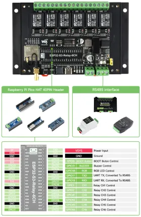
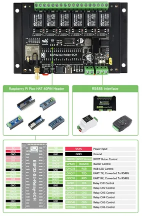

# ESP32-S3-Relay-6CH

**Waveshare** · ESP32-S3

Revision: Not identified  
Coverage: Pinout image collected

[Browse all manufacturers](../../../../BROWSE.md) · [Desktop app](https://github.com/valleytechsolutions/black-wire-desktop)

## Pinout

**pinout image** · Reviewed source · WEBP

[Open original reference](../../../../library/media/f5aea5c7a2159c8e07d07652f770da1a463ae02da85c2c3ba2e0c1f1c7c200df.webp)

**Credit and rights:** Not recorded; retain original attribution. Source/manufacturer: Waveshare.

[Source 1](https://docs.waveshare.com/assets/images/ESP32-S3-Relay-6CH-introduction-02-ffdf4390ad72784e806082cd72336f41.webp) · [Source 2](https://docs.waveshare.com/ESP32-S3-Relay-6CH)

SHA-256: `f5aea5c7a2159c8e07d07652f770da1a463ae02da85c2c3ba2e0c1f1c7c200df`

## Pinout

**pinout image** · Reviewed source · JPG

[Open original reference](../../../../library/media/38fdb2f6b11cbd10a5cd18e62117f3be4c2c3b26504db35a5a604bc6dd6a443a.jpg)

**Credit and rights:** Not recorded; retain original attribution. Source/manufacturer: Waveshare.

[Source 1](https://www.waveshare.com/w/upload/0/0a/ESP32-S3-Relay-6CH-introduction-02.jpg) · [Source 2](https://www.waveshare.com/wiki/ESP32-S3-Relay-6CH)

SHA-256: `38fdb2f6b11cbd10a5cd18e62117f3be4c2c3b26504db35a5a604bc6dd6a443a`

Pin assignments have not been independently electrically verified. Check board revision before wiring.
