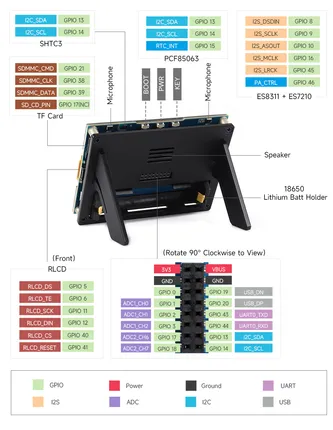

# ESP32-S3-RLCD-4.2

**Waveshare** · ESP32-S3

Revision: Not identified  
Coverage: Pinout image collected

[Browse all manufacturers](../../../../BROWSE.md) · [Desktop app](https://github.com/valleytechsolutions/black-wire-desktop)

## Pinout

**pinout image** · Reviewed source · JPG

[Open original reference](../../../../library/media/90af9932e3aa4991304239edfd4585d0f1a6a12f26c93e17de9dd7bd4914f9cc.jpg)

**Credit and rights:** Not recorded; retain original attribution. Source/manufacturer: Waveshare.

[Source 1](https://www.waveshare.com/img/devkit/LCD/ESP32-S3-RLCD-4.2/ESP32-S3-RLCD-4.2-details-10.jpg) · [Source 2](https://www.waveshare.com/esp32-s3-rlcd-4.2.htm)

SHA-256: `90af9932e3aa4991304239edfd4585d0f1a6a12f26c93e17de9dd7bd4914f9cc`

Pin assignments have not been independently electrically verified. Check board revision before wiring.
