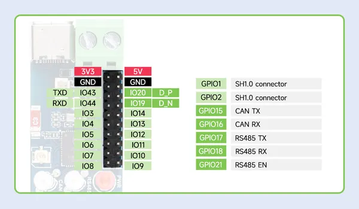
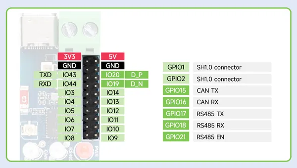

# ESP32-S3-RS485-CAN

**Waveshare** · ESP32-S3

Revision: Not identified  
Coverage: Pinout image collected

[Browse all manufacturers](../../../../BROWSE.md) · [Desktop app](https://github.com/valleytechsolutions/black-wire-desktop)

## Pinout

**pinout image** · Reviewed source · JPG

[Open original reference](../../../../library/media/a52f669ceb5dc90aa0a57ed8bb5ed3d85d5c36d394ea7775ef44fee6f14b49cc.jpg)

**Credit and rights:** Not recorded; retain original attribution. Source/manufacturer: Waveshare.

[Source 1](https://www.waveshare.com/img/devkit/ESP32-S3-RS485-CAN/ESP32-S3-RS485-CAN-details-15.jpg) · [Source 2](https://www.waveshare.com/esp32-s3-rs485-can.htm)

SHA-256: `a52f669ceb5dc90aa0a57ed8bb5ed3d85d5c36d394ea7775ef44fee6f14b49cc`

## Pinout

**pinout image** · Reviewed source · PNG

[Open original reference](../../../../library/media/6c4643fc629d95e7170fb9d43754c35c2c6d76250cfb10f9eaaaeec0bad368c8.png)

**Credit and rights:** Not recorded; retain original attribution. Source/manufacturer: Waveshare.

[Source 1](https://www.waveshare.com/w/upload/d/d9/ESP32-S3-RS485-CAN-details-15.png) · [Source 2](https://www.waveshare.com/wiki/ESP32-S3-RS485-CAN)

SHA-256: `6c4643fc629d95e7170fb9d43754c35c2c6d76250cfb10f9eaaaeec0bad368c8`

Pin assignments have not been independently electrically verified. Check board revision before wiring.
