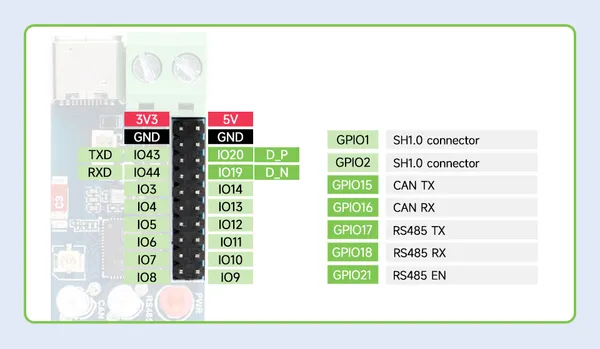
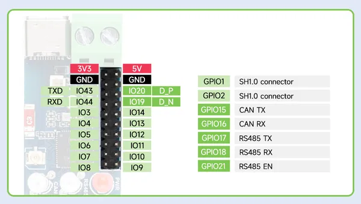

# ESP32-S3-RS485-CAN

**Waveshare** · ESP32-S3

Revision: Not identified

Coverage: Pinout image collected

[Browse all manufacturers](../../../../BROWSE.md) · [Devices & IoT](../../../../DEVICES.md) · [Open in the browser guide](https://valleytech-black-wire-guide.pages.dev/?board=waveshare-esp32-esp32-s3-rs485-can)

## Datasheets and original documentation

Board datasheet: **not yet recorded**. Visual reference: **available**.

[Manufacturer source (recorded link)](https://www.waveshare.com/esp32-s3-rs485-can.htm)

A chip datasheet, schematic and board datasheet have different scopes. Match the exact hardware revision.

[Documentation coverage and remaining gaps](../../../../DOCUMENTATION.md)

## Pinout

**pinout image** · Reviewed source · JPG

[Open original reference](../../../../library/media/a52f669ceb5dc90aa0a57ed8bb5ed3d85d5c36d394ea7775ef44fee6f14b49cc.jpg)

**Credit and rights:** Not recorded; retain original attribution. Source/manufacturer: Waveshare.

[Source 1](https://www.waveshare.com/img/devkit/ESP32-S3-RS485-CAN/ESP32-S3-RS485-CAN-details-15.jpg) · [Source 2](https://www.waveshare.com/esp32-s3-rs485-can.htm)

Image revision: Not identified

SHA-256: `a52f669ceb5dc90aa0a57ed8bb5ed3d85d5c36d394ea7775ef44fee6f14b49cc`

## Pinout

**pinout image** · Reviewed source · PNG

[Open original reference](../../../../library/media/6c4643fc629d95e7170fb9d43754c35c2c6d76250cfb10f9eaaaeec0bad368c8.png)

**Credit and rights:** Not recorded; retain original attribution. Source/manufacturer: Waveshare.

[Source 1](https://www.waveshare.com/w/upload/d/d9/ESP32-S3-RS485-CAN-details-15.png) · [Source 2](https://www.waveshare.com/wiki/ESP32-S3-RS485-CAN)

Image revision: Not identified

SHA-256: `6c4643fc629d95e7170fb9d43754c35c2c6d76250cfb10f9eaaaeec0bad368c8`

Pin assignments have not been independently electrically verified. Check board revision before wiring.
