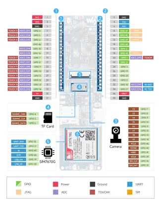

# ESP32-S3-SIM7670G-4G

**Waveshare** · ESP32-S3

Revision: Not identified  
Coverage: Pinout image collected

[Browse all manufacturers](../../../../BROWSE.md) · [Desktop app](https://github.com/valleytechsolutions/black-wire-desktop)

## Pinout

**pinout image** · Reviewed source · JPG

[Open original reference](../../../../library/media/5a0812a6dccb5eb6b4020bb2dba125b6fc06d3828301322cc31280540581d078.jpg)

**Credit and rights:** Not recorded; retain original attribution. Source/manufacturer: Waveshare.

[Source 1](https://www.waveshare.com/img/devkit/ESP32-S3-SIM7670G-4G/ESP32-S3-SIM7670G-4G-details-inter.jpg) · [Source 2](https://www.waveshare.com/esp32-s3-sim7670g-4g.htm)

SHA-256: `5a0812a6dccb5eb6b4020bb2dba125b6fc06d3828301322cc31280540581d078`

Pin assignments have not been independently electrically verified. Check board revision before wiring.
