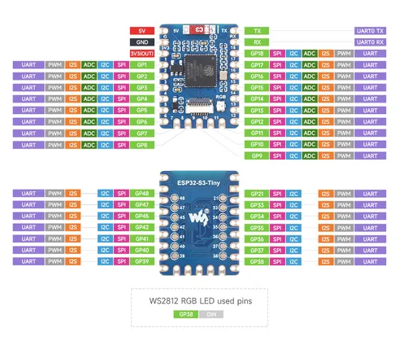
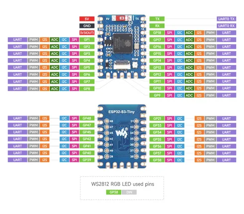
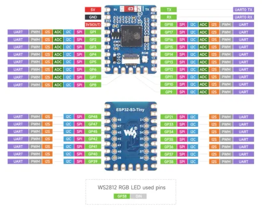

# ESP32-S3-Tiny

**Waveshare** · ESP32-S3

Revision: Not identified  
Coverage: Pinout image collected

[Browse all manufacturers](../../../../BROWSE.md) · [Desktop app](https://github.com/valleytechsolutions/black-wire-desktop)

## Pinout

**pinout image** · Reviewed source · JPG

[Open original reference](../../../../library/media/ca73c19d54de06bcbcf9a03c65a182e99ea4db90e6e13f8a5967614b0f31dd81.jpg)

**Credit and rights:** Not recorded; retain original attribution. Source/manufacturer: Waveshare.

[Source 1](https://www.waveshare.com/img/devkit/ESP32-S3-Tiny/ESP32-S3-Tiny-details-inter.jpg) · [Source 2](https://www.waveshare.com/esp32-s3-tiny.htm)

SHA-256: `ca73c19d54de06bcbcf9a03c65a182e99ea4db90e6e13f8a5967614b0f31dd81`

## Pinout

**pinout image** · Reviewed source · JPG

[Open original reference](../../../../library/media/d6ba0edc0f5a3215e9526effc8765ba45bc7bb7f5127aec86521ff5ea1893834.jpg)

**Credit and rights:** Not recorded; retain original attribution. Source/manufacturer: Waveshare.

[Source 1](https://www.waveshare.com/w/upload/9/93/ESP32-S3-Tiny-pinout.jpg) · [Source 2](https://www.waveshare.com/wiki/ESP32-S3-Tiny)

SHA-256: `d6ba0edc0f5a3215e9526effc8765ba45bc7bb7f5127aec86521ff5ea1893834`

## Pinout

**pinout image** · Reviewed source · WEBP

[Open original reference](../../../../library/media/23a8bd9f469d612283eee8a5b0fc759965da5751f41a7830b0741988389eb675.webp)

**Credit and rights:** Not recorded; retain original attribution. Source/manufacturer: Waveshare.

[Source 1](https://docs.waveshare.com/assets/images/ESP32-S3-Tiny-details-inter-fc4d043c04724600472e4ce8f10429a7.webp) · [Source 2](https://docs.waveshare.com/ESP32-S3-Tiny)

SHA-256: `23a8bd9f469d612283eee8a5b0fc759965da5751f41a7830b0741988389eb675`

Pin assignments have not been independently electrically verified. Check board revision before wiring.
