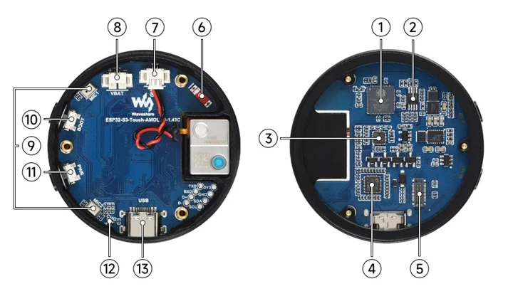
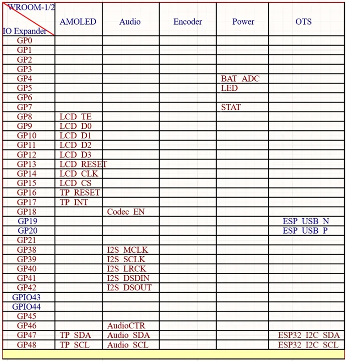
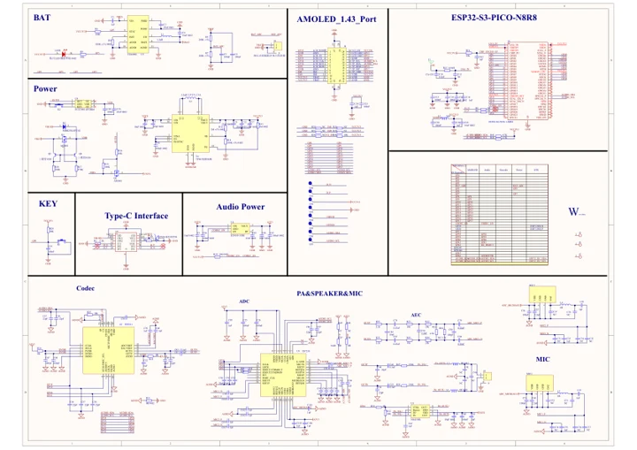

# ESP32-S3-Touch-AMOLED-1.43C

**Waveshare** · ESP32-S3

Revision: Not identified

Coverage: Manufacturer references reviewed by scope; independent electrical and all-connector review pending

[Browse all manufacturers](../../../../BROWSE.md) · [Devices & IoT](../../../../DEVICES.md) · [Open in the browser guide](https://valleytech-black-wire-guide.pages.dev/?board=waveshare-esp32-esp32-s3-touch-amoled-1-43c)

## Datasheets and original documentation

Board datasheet: **not yet recorded**. Visual reference: **available**.

[Manufacturer hardware documentation](https://docs.waveshare.com/ESP32-S3-Touch-AMOLED-1.43C)

- **schematic / board**: [ESP32-S3-Touch-AMOLED-1.43C Schematic](https://files.waveshare.com/wiki/ESP32-S3-Touch-AMOLED-1.43C/ESP32-S3-Touch-AMOLED-1.43C-Schematic.pdf) · [saved document](../../../../library/media/0fb3b7c99b432e603402b1a624b8a694b1ac002b17311fe258f3591e9eac9a74.pdf)
- **hardware-guide / board**: [Manufacturer pin and hardware documentation](https://docs.waveshare.com/ESP32-S3-Touch-AMOLED-1.43C) · online

A chip datasheet, schematic and board datasheet have different scopes. Match the exact hardware revision.

[Documentation coverage and remaining gaps](../../../../DOCUMENTATION.md)

## Onboard Resources ​

**board labeling image** · Source identity and visual scope inspected; PDF review covers first-page preview. Independent electrical and all-connector completeness review pending. · WEBP

[Open original reference](../../../../library/media/872d79c89a7fd7a9414f7c4b53dcaae20126d8129f8db46483e5a1599fce7c88.webp)

**Credit and rights:** Manufacturer artwork; reuse and print rights not established. Inclusion does not relicense the original.. Source/manufacturer: Waveshare.

[Source 1](https://docs.waveshare.com/assets/images/ESP32-S3-Touch-AMOLED-1.43C-HW-1-9975e69ffd2268116366029ac50d485d.webp) · [Source 2](https://docs.waveshare.com/ESP32-S3-Touch-AMOLED-1.43C)

Manufacturer source retained unchanged. Source identity and visual scope inspected; PDF review covers first-page preview. Independent electrical and all-connector completeness review pending. See the linked manufacturer page for the numbered component legend. This is not a complete physical pinout.

Image revision: As supplied in the original; match exact board revision

SHA-256: `872d79c89a7fd7a9414f7c4b53dcaae20126d8129f8db46483e5a1599fce7c88`

## Interface Introduction ​

**pin function reference** · Source identity and visual scope inspected; PDF review covers first-page preview. Independent electrical and all-connector completeness review pending. · WEBP

[Open original reference](../../../../library/media/ae0d824ec240cf811203d9d54866fdb3b684d64b9c1cd38d9892c5cdd05b5aa0.webp)

**Credit and rights:** Manufacturer artwork; reuse and print rights not established. Inclusion does not relicense the original.. Source/manufacturer: Waveshare.

[Source 1](https://docs.waveshare.com/assets/images/ESP32-S3-Touch-AMOLED-1.43C-IntfIntro-febd2451f9cd444256f31102ead9bd10.webp) · [Source 2](https://docs.waveshare.com/ESP32-S3-Touch-AMOLED-1.43C)

Manufacturer source retained unchanged. Source identity and visual scope inspected; PDF review covers first-page preview. Independent electrical and all-connector completeness review pending.

Image revision: As supplied in the original; match exact board revision

SHA-256: `ae0d824ec240cf811203d9d54866fdb3b684d64b9c1cd38d9892c5cdd05b5aa0`

## ESP32-S3-Touch-AMOLED-1.43C Schematic

**original reference PDF** · Source identity and visual scope inspected; PDF review covers first-page preview. Independent electrical and all-connector completeness review pending. · PDF

[Open original reference](../../../../library/media/0fb3b7c99b432e603402b1a624b8a694b1ac002b17311fe258f3591e9eac9a74.pdf)

**Credit and rights:** Manufacturer artwork; reuse and print rights not established. Inclusion does not relicense the original.. Source/manufacturer: Waveshare.

[Source 1](https://files.waveshare.com/wiki/ESP32-S3-Touch-AMOLED-1.43C/ESP32-S3-Touch-AMOLED-1.43C-Schematic.pdf) · [Source 2](https://docs.waveshare.com/ESP32-S3-Touch-AMOLED-1.43C/Resources-And-Documents)

Manufacturer source retained unchanged. Source identity and visual scope inspected; PDF review covers first-page preview. Independent electrical and all-connector completeness review pending.

Image revision: As supplied in the original; match exact board revision

SHA-256: `0fb3b7c99b432e603402b1a624b8a694b1ac002b17311fe258f3591e9eac9a74`

Pin assignments have not been independently electrically verified. Check board revision before wiring.
