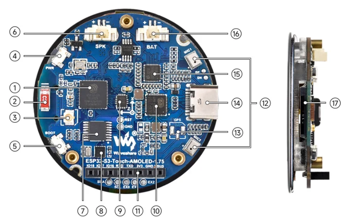
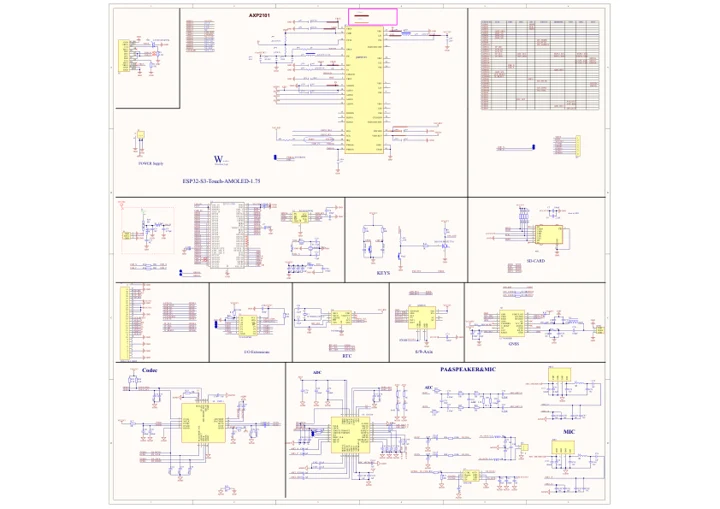

# ESP32-S3-Touch-AMOLED-1.75

**Waveshare** · ESP32-S3

Revision: Not identified

Coverage: Manufacturer references reviewed by scope; independent electrical and all-connector review pending

[Browse all manufacturers](../../../../BROWSE.md) · [Devices & IoT](../../../../DEVICES.md) · [Open in the browser guide](https://valleytech-black-wire-guide.pages.dev/?board=waveshare-esp32-esp32-s3-touch-amoled-1-75)

## Datasheets and original documentation

Board datasheet: **not yet recorded**. Visual reference: **available**.

[Manufacturer hardware documentation](https://www.waveshare.com/wiki/ESP32-S3-Touch-AMOLED-1.75)

- **schematic / board**: [ESP32-S3-Touch-AMOLED-1.75 Schematic diagram](https://files.waveshare.com/wiki/ESP32-S3-Touch-AMOLED-1.75/ESP32-S3-Touch-AMOLED-1.75.pdf) · [saved document](../../../../library/media/26d33d14ae975f8d6817d103c41e704dc0682c8b28e61aed845dba933e9133e3.pdf)
- **hardware-guide / board**: [Manufacturer pin and hardware documentation](https://www.waveshare.com/wiki/ESP32-S3-Touch-AMOLED-1.75) · online

A chip datasheet, schematic and board datasheet have different scopes. Match the exact hardware revision.

[Documentation coverage and remaining gaps](../../../../DOCUMENTATION.md)

## Hardware Description

**board labeling image** · Source identity and visual scope inspected; PDF review covers first-page preview. Independent electrical and all-connector completeness review pending. · PNG

[Open original reference](../../../../library/media/f5a5664777f2f5b4a06ebdd18f058713d3e4d8fffe0a189afca1b3ad666493b4.png)

**Credit and rights:** Manufacturer artwork; reuse and print rights not established. Inclusion does not relicense the original.. Source/manufacturer: Waveshare.

[Source 1](https://www.waveshare.com/w/upload/2/29/ESP32-S3-Touch-AMOLED-1.75-details-intro.png) · [Source 2](https://www.waveshare.com/wiki/ESP32-S3-Touch-AMOLED-1.75)

Manufacturer source retained unchanged. Source identity and visual scope inspected; PDF review covers first-page preview. Independent electrical and all-connector completeness review pending. See the linked manufacturer page for the numbered component legend. This is not a complete physical pinout.

Image revision: As supplied in the original; match exact board revision

SHA-256: `f5a5664777f2f5b4a06ebdd18f058713d3e4d8fffe0a189afca1b3ad666493b4`

## ESP32-S3-Touch-AMOLED-1.75 Schematic diagram

**original reference PDF** · Source identity and visual scope inspected; PDF review covers first-page preview. Independent electrical and all-connector completeness review pending. · PDF

[Open original reference](../../../../library/media/26d33d14ae975f8d6817d103c41e704dc0682c8b28e61aed845dba933e9133e3.pdf)

**Credit and rights:** Manufacturer artwork; reuse and print rights not established. Inclusion does not relicense the original.. Source/manufacturer: Waveshare.

[Source 1](https://files.waveshare.com/wiki/ESP32-S3-Touch-AMOLED-1.75/ESP32-S3-Touch-AMOLED-1.75.pdf) · [Source 2](https://www.waveshare.com/wiki/ESP32-S3-Touch-AMOLED-1.75)

Manufacturer source retained unchanged. Source identity and visual scope inspected; PDF review covers first-page preview. Independent electrical and all-connector completeness review pending.

Image revision: As supplied in the original; match exact board revision

SHA-256: `26d33d14ae975f8d6817d103c41e704dc0682c8b28e61aed845dba933e9133e3`

Pin assignments have not been independently electrically verified. Check board revision before wiring.
