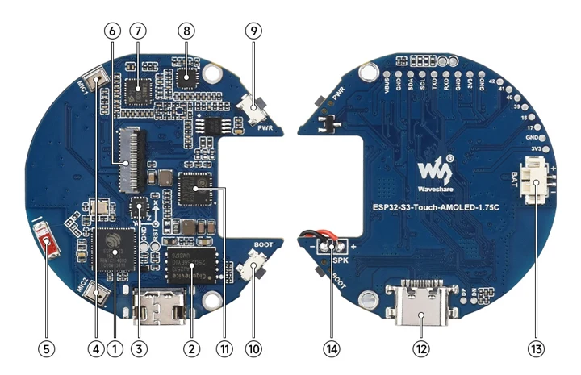
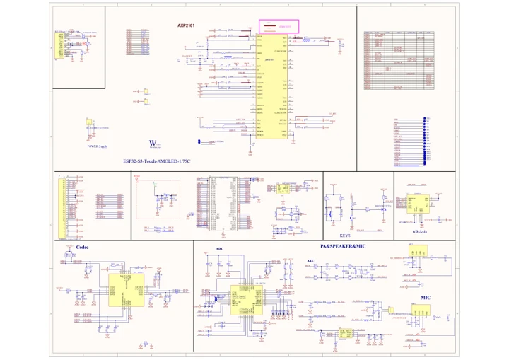

# ESP32-S3-Touch-AMOLED-1.75C

**Waveshare** · ESP32-S3

Revision: Not identified

Coverage: Manufacturer references reviewed by scope; independent electrical and all-connector review pending

[Browse all manufacturers](../../../../BROWSE.md) · [Devices & IoT](../../../../DEVICES.md) · [Open in the browser guide](https://valleytech-black-wire-guide.pages.dev/?board=waveshare-esp32-esp32-s3-touch-amoled-1-75c)

## Datasheets and original documentation

Board datasheet: **not yet recorded**. Visual reference: **available**.

[Manufacturer hardware documentation](https://docs.waveshare.com/ESP32-S3-Touch-AMOLED-1.75C)

- **schematic / board**: [ESP32-S3-Touch-AMOLED-1.75C Schematic](https://files.waveshare.com/wiki/ESP32-S3-Touch-AMOLED-1.75C/ESP32-S3-Touch-AMOLED-1.75C-schematic.pdf) · [saved document](../../../../library/media/7bcc0a3a9dc02893741e1e555b203a17055b5cc9cce3b5c548e160e21683900d.pdf)
- **hardware-guide / board**: [Manufacturer pin and hardware documentation](https://docs.waveshare.com/ESP32-S3-Touch-AMOLED-1.75C) · online

A chip datasheet, schematic and board datasheet have different scopes. Match the exact hardware revision.

[Documentation coverage and remaining gaps](../../../../DOCUMENTATION.md)

## Onboard Resources ​

**board labeling image** · Source identity and visual scope inspected; PDF review covers first-page preview. Independent electrical and all-connector completeness review pending. · WEBP

[Open original reference](../../../../library/media/837e1f04abe1879c3a2031c522d12d483e3fd5da537d39eb18560c7cff47cddc.webp)

**Credit and rights:** Manufacturer artwork; reuse and print rights not established. Inclusion does not relicense the original.. Source/manufacturer: Waveshare.

[Source 1](https://docs.waveshare.com/assets/images/ESP32-S3-Touch-AMOLED-1.75C-details-intro-a6535c5c1ec9caa51d4a50b14e4166fe.webp) · [Source 2](https://docs.waveshare.com/ESP32-S3-Touch-AMOLED-1.75C)

Manufacturer source retained unchanged. Source identity and visual scope inspected; PDF review covers first-page preview. Independent electrical and all-connector completeness review pending. See the linked manufacturer page for the numbered component legend. This is not a complete physical pinout.

Image revision: As supplied in the original; match exact board revision

SHA-256: `837e1f04abe1879c3a2031c522d12d483e3fd5da537d39eb18560c7cff47cddc`

## ESP32-S3-Touch-AMOLED-1.75C Schematic

**original reference PDF** · Source identity and visual scope inspected; PDF review covers first-page preview. Independent electrical and all-connector completeness review pending. · PDF

[Open original reference](../../../../library/media/7bcc0a3a9dc02893741e1e555b203a17055b5cc9cce3b5c548e160e21683900d.pdf)

**Credit and rights:** Manufacturer artwork; reuse and print rights not established. Inclusion does not relicense the original.. Source/manufacturer: Waveshare.

[Source 1](https://files.waveshare.com/wiki/ESP32-S3-Touch-AMOLED-1.75C/ESP32-S3-Touch-AMOLED-1.75C-schematic.pdf) · [Source 2](https://docs.waveshare.com/ESP32-S3-Touch-AMOLED-1.75C/Resources-And-Documents)

Manufacturer source retained unchanged. Source identity and visual scope inspected; PDF review covers first-page preview. Independent electrical and all-connector completeness review pending.

Image revision: As supplied in the original; match exact board revision

SHA-256: `7bcc0a3a9dc02893741e1e555b203a17055b5cc9cce3b5c548e160e21683900d`

Pin assignments have not been independently electrically verified. Check board revision before wiring.
