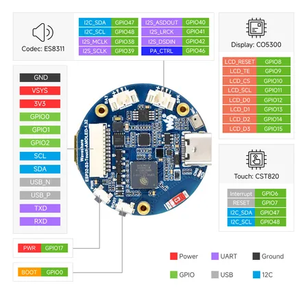

# ESP32-S3-Touch-AMOLED-1.32

**Waveshare** · ESP32-S3

Revision: Not identified  
Coverage: Pinout image collected

[Browse all manufacturers](../../../../BROWSE.md) · [Desktop app](https://github.com/valleytechsolutions/black-wire-desktop)

## Pinout

**pinout image** · Reviewed source · JPG

[Open original reference](../../../../library/media/703d4fff9aea846926740a5844e5e24661adad6fc72d1d840f8ac41bb9ae24de.jpg)

**Credit and rights:** Not recorded; retain original attribution. Source/manufacturer: Waveshare.

[Source 1](https://www.waveshare.com/img/devkit/ESP32-S3-Touch-AMOLED-1.32/ESP32-S3-Touch-AMOLED-1.32-details-25.jpg) · [Source 2](https://www.waveshare.com/esp32-s3-touch-amoled-1.32.htm)

SHA-256: `703d4fff9aea846926740a5844e5e24661adad6fc72d1d840f8ac41bb9ae24de`

Pin assignments have not been independently electrically verified. Check board revision before wiring.
