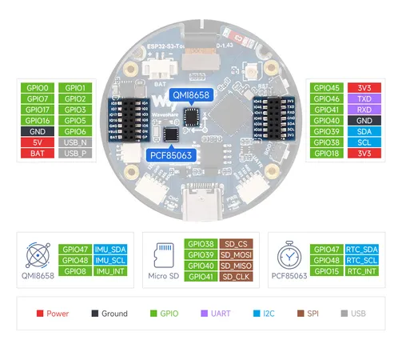

# ESP32-S3-Touch-AMOLED-1.43

**Waveshare** · ESP32-S3

Revision: Not identified  
Coverage: Pinout image collected

[Browse all manufacturers](../../../../BROWSE.md) · [Desktop app](https://github.com/valleytechsolutions/black-wire-desktop)

## Pinout

**pinout image** · Reviewed source · JPG

[Open original reference](../../../../library/media/c231679548a63d639e5f9f2121441c9c93b9c4298060d220ade4aa0a17d96516.jpg)

**Credit and rights:** Not recorded; retain original attribution. Source/manufacturer: Waveshare.

[Source 1](https://www.waveshare.com/img/devkit/ESP32-S3-Touch-AMOLED-1.43/ESP32-S3-Touch-AMOLED-1.43-details-inter.jpg) · [Source 2](https://www.waveshare.com/esp32-s3-touch-amoled-1.43.htm)

Waveshare product page links to wiki with a misspelled title; assigned using product name and asset filename.

SHA-256: `c231679548a63d639e5f9f2121441c9c93b9c4298060d220ade4aa0a17d96516`

Pin assignments have not been independently electrically verified. Check board revision before wiring.
