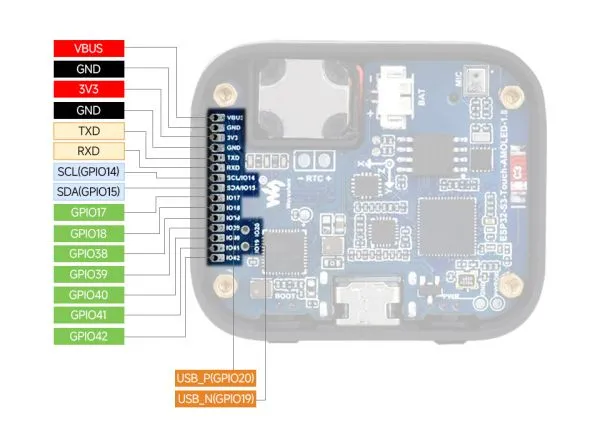

# ESP32-S3-Touch-AMOLED-1.8

**Waveshare** · ESP32-S3

Revision: Not identified  
Coverage: Pinout image collected

[Browse all manufacturers](../../../../BROWSE.md) · [Desktop app](https://github.com/valleytechsolutions/black-wire-desktop)

## Pinout

**pinout image** · Reviewed source · JPG

[Open original reference](../../../../library/media/f4857cded4418d651fcce3d53b82443286458472b49886638e03d5f7eb7b896d.jpg)

**Credit and rights:** Not recorded; retain original attribution. Source/manufacturer: Waveshare.

[Source 1](https://www.waveshare.com/img/devkit/ESP32-S3-Touch-AMOLED-1.8/ESP32-S3-Touch-AMOLED-1.8-details-15.jpg) · [Source 2](https://www.waveshare.com/esp32-s3-touch-amoled-1.8.htm)

SHA-256: `f4857cded4418d651fcce3d53b82443286458472b49886638e03d5f7eb7b896d`

## Pinout

**pinout image** · Reviewed source · WEBP

[Open original reference](../../../../library/media/2f66b70063d76ca2a28cc61da6d55b36912ecfcf8a4e3594256ecca7030b8527.webp)

**Credit and rights:** Not recorded; retain original attribution. Source/manufacturer: Waveshare.

[Source 1](https://docs.waveshare.com/assets/images/ESP32-S3-Touch-AMOLED-1.8-details-15-29e01308259f0cbe05e3a0f866adcb5e.webp) · [Source 2](https://docs.waveshare.com/ESP32-S3-Touch-AMOLED-1.8)

SHA-256: `2f66b70063d76ca2a28cc61da6d55b36912ecfcf8a4e3594256ecca7030b8527`

## Pinout

**pinout image** · Reviewed source · JPG

[Open original reference](../../../../library/media/62fb28d705823f4b683560a921a2f9433c9c862f9df9b76744d7f724d09c963b.jpg)

**Credit and rights:** Not recorded; retain original attribution. Source/manufacturer: Waveshare.

[Source 1](https://www.waveshare.com/w/upload/2/2d/600px-ESP32-S3-Touch-AMOLED-1.8-details-15.jpg) · [Source 2](https://www.waveshare.com/wiki/ESP32-S3-Touch-AMOLED-1.8)

SHA-256: `62fb28d705823f4b683560a921a2f9433c9c862f9df9b76744d7f724d09c963b`

Pin assignments have not been independently electrically verified. Check board revision before wiring.
