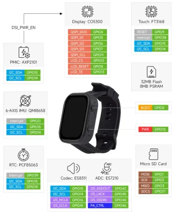

# ESP32-S3-Touch-AMOLED-2.06

**Waveshare** · ESP32-S3

Revision: Not identified  
Coverage: GPIO reference collected; physical pinout needed

[Browse all manufacturers](../../../../BROWSE.md) · [Desktop app](https://github.com/valleytechsolutions/black-wire-desktop)

## GPIO peripheral assignments

**GPIO reference image** · Reviewed source · WEBP

[Open original reference](../../../../library/media/be8aedc41129a5e5352587632bf75aa85204e334e27f0acd64851650b443a0ef.webp)

**Credit and rights:** Not established; source attribution retained. Source/manufacturer: Waveshare.

[Source 1](https://docs.waveshare.com/assets/images/ESP32-S3-Touch-AMOLED-2.06-details-inter-41ffaa4cd3c631aa34ca153e4e4778b6.webp) · [Source 2](https://docs.waveshare.com/ESP32-S3-Touch-AMOLED-2.06)

Official reference image. This is useful for board peripherals but must not be treated as a physical header/pad pinout. Board remains in the pinout research queue.

**Partial diagram. Confirm missing pins against the exact board documentation.**

SHA-256: `be8aedc41129a5e5352587632bf75aa85204e334e27f0acd64851650b443a0ef`

Pin assignments have not been independently electrically verified. Check board revision before wiring.
