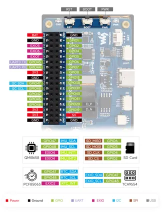

# ESP32-S3-Touch-AMOLED-2.41

**Waveshare** · ESP32-S3

Revision: Not identified  
Coverage: Pinout image collected

[Browse all manufacturers](../../../../BROWSE.md) · [Desktop app](https://github.com/valleytechsolutions/black-wire-desktop)

## Pinout

**pinout image** · Reviewed source · JPG

[Open original reference](../../../../library/media/a2b2ac2bc7c77fac568981d5314fa607934c2a27462a1f72985af7e2b25b30d4.jpg)

**Credit and rights:** Not recorded; retain original attribution. Source/manufacturer: Waveshare.

[Source 1](https://www.waveshare.com/img/devkit/ESP32-S3-Touch-AMOLED-2.41/ESP32-S3-Touch-AMOLED-2.41-details-inter.jpg) · [Source 2](https://www.waveshare.com/esp32-s3-touch-amoled-2.41.htm)

SHA-256: `a2b2ac2bc7c77fac568981d5314fa607934c2a27462a1f72985af7e2b25b30d4`

Pin assignments have not been independently electrically verified. Check board revision before wiring.
