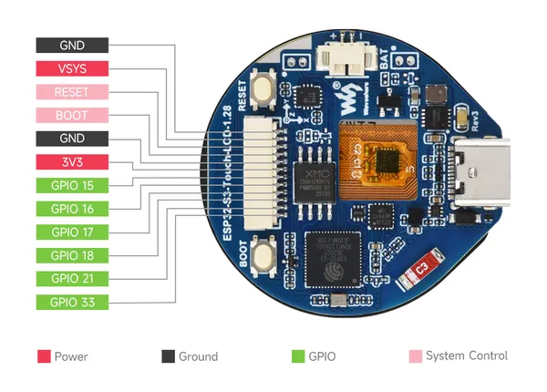
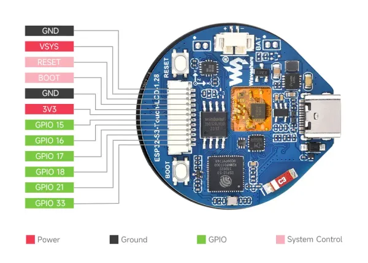
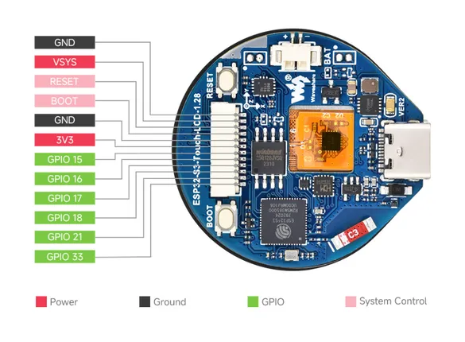

# ESP32-S3-Touch-LCD-1.28

**Waveshare** · ESP32-S3

Revision: Not identified  
Coverage: Pinout image collected

[Browse all manufacturers](../../../../BROWSE.md) · [Desktop app](https://github.com/valleytechsolutions/black-wire-desktop)

## Pinout

**pinout image** · Reviewed source · JPG

[Open original reference](../../../../library/media/b36e2830faa5dfb5dc0b3644348432f20d98c91d775c84fc550721fb4beebf0f.jpg)

**Credit and rights:** Not recorded; retain original attribution. Source/manufacturer: Waveshare.

[Source 1](https://www.waveshare.com/img/devkit/ESP32-S3-Touch-LCD-1.28/ESP32-S3-Touch-LCD-1.28-details-inter.jpg) · [Source 2](https://www.waveshare.com/esp32-s3-touch-lcd-1.28.htm) · [Source 3](https://www.waveshare.com/esp32-s3-touch-lcd-1.28-b.htm)

SHA-256: `b36e2830faa5dfb5dc0b3644348432f20d98c91d775c84fc550721fb4beebf0f`

## Pinout

**pinout image** · Reviewed source · WEBP

[Open original reference](../../../../library/media/6479f0a1964662a4a4ebdcd03e78e898a80fb453063d23ca550fcb80598f8554.webp)

**Credit and rights:** Not recorded; retain original attribution. Source/manufacturer: Waveshare.

[Source 1](https://docs.waveshare.com/assets/images/Esp32-s3-touch-lcd-1.28-003-c7bcf4bd1440b55a43abb060ad67d705.webp) · [Source 2](https://docs.waveshare.com/ESP32-S3-Touch-LCD-1.28)

SHA-256: `6479f0a1964662a4a4ebdcd03e78e898a80fb453063d23ca550fcb80598f8554`

## Pinout

**pinout image** · Reviewed source · PNG

[Open original reference](../../../../library/media/4cced2fdc4c663cfcd4ace0752962dca3260f9948f34188150ce96fd7f39e7be.png)

**Credit and rights:** Not recorded; retain original attribution. Source/manufacturer: Waveshare.

[Source 1](https://www.waveshare.com/w/upload/d/d5/Esp32-s3-touch-lcd-1.28-003.png) · [Source 2](https://www.waveshare.com/wiki/ESP32-S3-Touch-LCD-1.28)

SHA-256: `4cced2fdc4c663cfcd4ace0752962dca3260f9948f34188150ce96fd7f39e7be`

Pin assignments have not been independently electrically verified. Check board revision before wiring.
