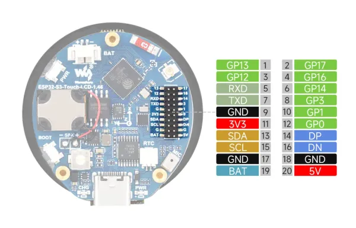

# ESP32-S3-Touch-LCD-1.46

**Waveshare** · ESP32-S3

Revision: Not identified  
Coverage: Pinout image collected

[Browse all manufacturers](../../../../BROWSE.md) · [Desktop app](https://github.com/valleytechsolutions/black-wire-desktop)

## Pinout

**pinout image** · Reviewed source · WEBP

[Open original reference](../../../../library/media/4d02a7350b2f782a8aae43d17696a73ecc88a9e64db26b765f8f2560947aecf3.webp)

**Credit and rights:** Not recorded; retain original attribution. Source/manufacturer: Waveshare.

[Source 1](https://docs.waveshare.com/assets/images/ESP32-S3-Touch-LCD-1.46-introduction-02-1a3d633749ce37f09cb0736f452ae9f6.webp) · [Source 2](https://docs.waveshare.com/ESP32-S3-Touch-LCD-1.46)

SHA-256: `4d02a7350b2f782a8aae43d17696a73ecc88a9e64db26b765f8f2560947aecf3`

Pin assignments have not been independently electrically verified. Check board revision before wiring.
