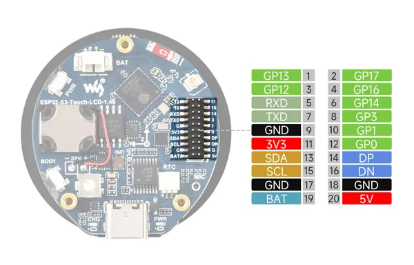
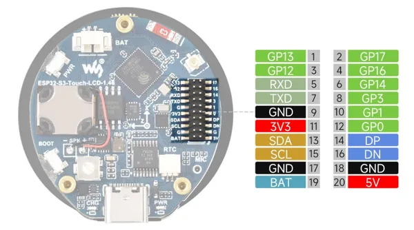

# ESP32-S3-Touch-LCD-1.46B

**Waveshare** · ESP32-S3

Revision: Not identified  
Coverage: Pinout image collected

[Browse all manufacturers](../../../../BROWSE.md) · [Desktop app](https://github.com/valleytechsolutions/black-wire-desktop)

## Pinout

**pinout image** · Reviewed source · JPG

[Open original reference](../../../../library/media/bc1636424d8af076f46fb9369e831ffb17d6cb3bd41dfd23750e323945357d55.jpg)

**Credit and rights:** Not recorded; retain original attribution. Source/manufacturer: Waveshare.

[Source 1](https://www.waveshare.com/img/devkit/ESP32-S3-Touch-LCD-1.46B/ESP32-S3-Touch-LCD-1.46B-details-intro.jpg) · [Source 2](https://www.waveshare.com/esp32-s3-touch-lcd-1.46b.htm)

SHA-256: `bc1636424d8af076f46fb9369e831ffb17d6cb3bd41dfd23750e323945357d55`

## Pinout

**pinout image** · Reviewed source · JPG

[Open original reference](../../../../library/media/3f8e5ba5b4e6e914a248db6bc9ed8a05cd4fb75ba3ce59bb152d0540aa7374df.jpg)

**Credit and rights:** Not recorded; retain original attribution. Source/manufacturer: Waveshare.

[Source 1](https://www.waveshare.com/w/upload/7/72/600px-ESP32-S3-Touch-LCD-1.46-introduction-02_1.jpg) · [Source 2](https://www.waveshare.com/wiki/ESP32-S3-Touch-LCD-1.46B)

SHA-256: `3f8e5ba5b4e6e914a248db6bc9ed8a05cd4fb75ba3ce59bb152d0540aa7374df`

Pin assignments have not been independently electrically verified. Check board revision before wiring.
