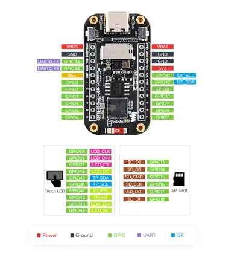
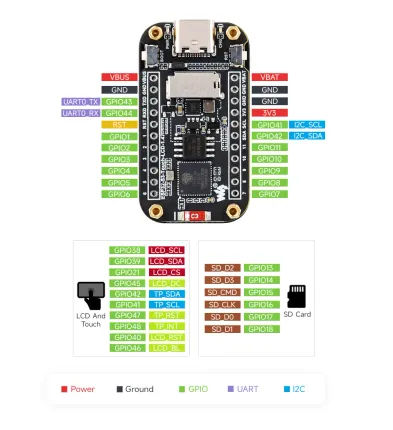
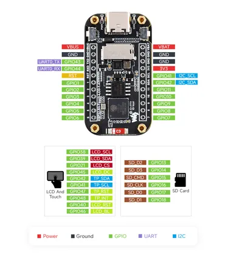

# ESP32-S3-Touch-LCD-1.47

**Waveshare** · ESP32-S3

Revision: Not identified  
Coverage: Pinout image collected

[Browse all manufacturers](../../../../BROWSE.md) · [Desktop app](https://github.com/valleytechsolutions/black-wire-desktop)

## Pinout

**pinout image** · Reviewed source · JPG

[Open original reference](../../../../library/media/4797b6d6af810575a5cd1a6a8daafeb9a52395409c29b5edea520fa0f34031ff.jpg)

**Credit and rights:** Not recorded; retain original attribution. Source/manufacturer: Waveshare.

[Source 1](https://www.waveshare.com/img/devkit/ESP32-S3-Touch-LCD-1.47/ESP32-S3-Touch-LCD-1.47-details-inter.jpg) · [Source 2](https://www.waveshare.com/esp32-s3-touch-lcd-1.47.htm)

SHA-256: `4797b6d6af810575a5cd1a6a8daafeb9a52395409c29b5edea520fa0f34031ff`

## Pinout

**pinout image** · Reviewed source · WEBP

[Open original reference](../../../../library/media/90df831afe9a82ff66ad4955e670321d53d3f9a1a7a77dd222cb3018ba6a9fa3.webp)

**Credit and rights:** Not recorded; retain original attribution. Source/manufacturer: Waveshare.

[Source 1](https://docs.waveshare.com/assets/images/ESP32-S3-Touch-LCD-1.47-details-inter-f60fcf8e6f1405b29f83509d1d1246e7.webp) · [Source 2](https://docs.waveshare.com/ESP32-S3-Touch-LCD-1.47)

SHA-256: `90df831afe9a82ff66ad4955e670321d53d3f9a1a7a77dd222cb3018ba6a9fa3`

## Pinout

**pinout image** · Reviewed source · JPG

[Open original reference](../../../../library/media/471a6a3b2cccbe2cd5ea085ef2c2d21d5a0396e9b9db76e40139b0cbddbe108a.jpg)

**Credit and rights:** Not recorded; retain original attribution. Source/manufacturer: Waveshare.

[Source 1](https://www.waveshare.com/w/upload/3/3f/ESP32-S3-Touch-LCD-1.47-details-inter.jpg) · [Source 2](https://www.waveshare.com/wiki/ESP32-S3-Touch-LCD-1.47)

SHA-256: `471a6a3b2cccbe2cd5ea085ef2c2d21d5a0396e9b9db76e40139b0cbddbe108a`

Pin assignments have not been independently electrically verified. Check board revision before wiring.
