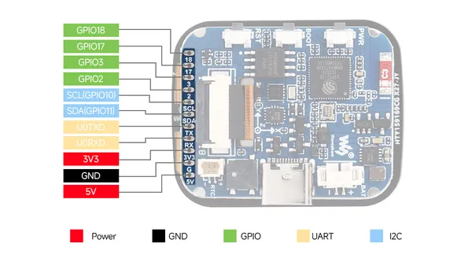
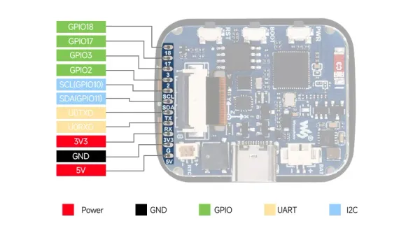
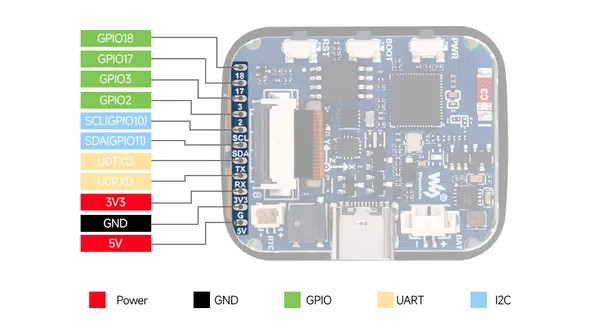

# ESP32-S3-Touch-LCD-1.69

**Waveshare** · ESP32-S3

Revision: Not identified  
Coverage: Pinout image collected

[Browse all manufacturers](../../../../BROWSE.md) · [Desktop app](https://github.com/valleytechsolutions/black-wire-desktop)

## Pinout

**pinout image** · Reviewed source · JPG

[Open original reference](../../../../library/media/fac684b28b567eb410083a6237ebdcb1632f769276441ed412df68785ad2375d.jpg)

**Credit and rights:** Not recorded; retain original attribution. Source/manufacturer: Waveshare.

[Source 1](https://www.waveshare.com/img/devkit/ESP32-S3-Touch-LCD-1.69/ESP32-S3-Touch-LCD-1.69-details-5.jpg) · [Source 2](https://www.waveshare.com/esp32-s3-touch-lcd-1.69.htm)

SHA-256: `fac684b28b567eb410083a6237ebdcb1632f769276441ed412df68785ad2375d`

## Pinout

**pinout image** · Reviewed source · WEBP

[Open original reference](../../../../library/media/bc1aa52d0d24ca30228a1b4579732972ba14520999900a94416be64e8ec10442.webp)

**Credit and rights:** Not recorded; retain original attribution. Source/manufacturer: Waveshare.

[Source 1](https://docs.waveshare.com/assets/images/ESP32-S3-Touch-LCD-1.69-Pinout-9eb7123eddd52dc51577bba392a34e65.webp) · [Source 2](https://docs.waveshare.com/ESP32-S3-Touch-LCD-1.69)

SHA-256: `bc1aa52d0d24ca30228a1b4579732972ba14520999900a94416be64e8ec10442`

## Pinout

**pinout image** · Reviewed source · JPG

[Open original reference](../../../../library/media/219bfc83c35bf0a6b91fb2577d84f0de89792ca7e15dbd0c12903a4437ccd3a2.jpg)

**Credit and rights:** Not recorded; retain original attribution. Source/manufacturer: Waveshare.

[Source 1](https://www.waveshare.com/w/upload/d/dd/ESP32-S3-Touch-LCD-1.69-details-5.jpg) · [Source 2](https://www.waveshare.com/wiki/ESP32-S3-Touch-LCD-1.69)

SHA-256: `219bfc83c35bf0a6b91fb2577d84f0de89792ca7e15dbd0c12903a4437ccd3a2`

Pin assignments have not been independently electrically verified. Check board revision before wiring.
