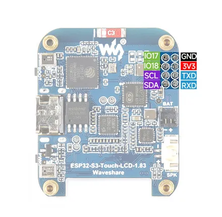

# ESP32-S3-Touch-LCD-1.83

**Waveshare** · ESP32-S3

Revision: Not identified  
Coverage: Pinout image collected

[Browse all manufacturers](../../../../BROWSE.md) · [Desktop app](https://github.com/valleytechsolutions/black-wire-desktop)

## Pinout

**pinout image** · Reviewed source · JPG

[Open original reference](../../../../library/media/ff9a4404832672e63c1fbee27977934aa1fe7fdb3f39d2ccb0d256605815fdb0.jpg)

**Credit and rights:** Not recorded; retain original attribution. Source/manufacturer: Waveshare.

[Source 1](https://www.waveshare.com/w/upload/6/69/ESP32-S3-Touch-LCD-1.83-intro-wiki.jpg) · [Source 2](https://www.waveshare.com/wiki/ESP32-S3-Touch-LCD-1.83)

SHA-256: `ff9a4404832672e63c1fbee27977934aa1fe7fdb3f39d2ccb0d256605815fdb0`

Pin assignments have not been independently electrically verified. Check board revision before wiring.
