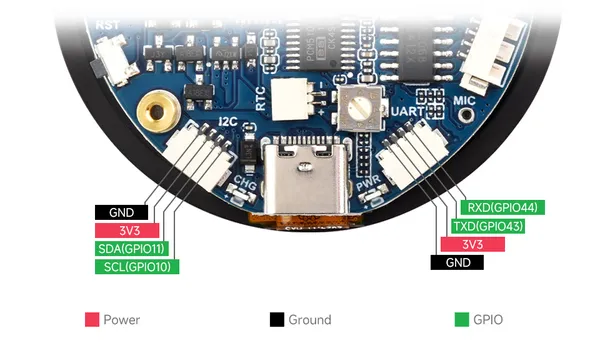
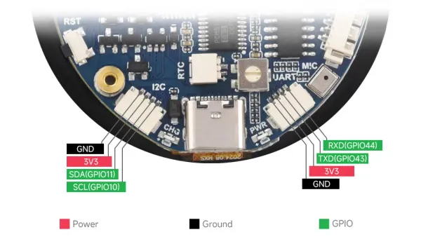

# ESP32-S3-Touch-LCD-1.85

**Waveshare** · ESP32-S3

Revision: Not identified  
Coverage: Pinout image collected

[Browse all manufacturers](../../../../BROWSE.md) · [Desktop app](https://github.com/valleytechsolutions/black-wire-desktop)

## Pinout

**pinout image** · Reviewed source · JPG

[Open original reference](../../../../library/media/c0dfa8b1d8a14096f40d0a205f32f53407684b440a0897f75f0f6a0748196925.jpg)

**Credit and rights:** Not recorded; retain original attribution. Source/manufacturer: Waveshare.

[Source 1](https://www.waveshare.com/img/devkit/ESP32-S3-Touch-LCD-1.85/ESP32-S3-Touch-LCD-1.85-details-9.jpg) · [Source 2](https://www.waveshare.com/esp32-s3-touch-lcd-1.85.htm)

SHA-256: `c0dfa8b1d8a14096f40d0a205f32f53407684b440a0897f75f0f6a0748196925`

## Pinout

**pinout image** · Reviewed source · WEBP

[Open original reference](../../../../library/media/b3ddd8821f9765798c71cf71e6779568d4034c4ea537f61d3a527476a3463a71.webp)

**Credit and rights:** Not recorded; retain original attribution. Source/manufacturer: Waveshare.

[Source 1](https://docs.waveshare.com/assets/images/ESP32-S3-Touch-LCD-1.85-introduction-02-133ade067dfefefd63f2e400a45d68d2.webp) · [Source 2](https://docs.waveshare.com/ESP32-S3-Touch-LCD-1.85) · [Source 3](https://docs.waveshare.com/ESP32-S3-Touch-LCD-1.85C)

SHA-256: `b3ddd8821f9765798c71cf71e6779568d4034c4ea537f61d3a527476a3463a71`

Pin assignments have not been independently electrically verified. Check board revision before wiring.
