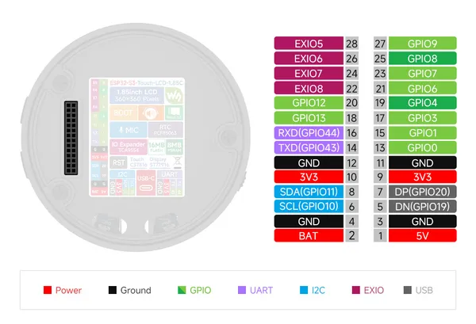
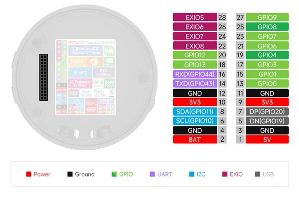

# ESP32-S3-Touch-LCD-1.85C

**Waveshare** · ESP32-S3

Revision: Not identified  
Coverage: Pinout image collected

[Browse all manufacturers](../../../../BROWSE.md) · [Desktop app](https://github.com/valleytechsolutions/black-wire-desktop)

## Pinout

**pinout image** · Reviewed source · JPG

[Open original reference](../../../../library/media/1a3cc66496f0d130e4190f7ed0e9e1e6ecb86e16da10c8701ec2ec4eac07fa2c.jpg)

**Credit and rights:** Not recorded; retain original attribution. Source/manufacturer: Waveshare.

[Source 1](https://www.waveshare.com/img/devkit/ESP32-S3-Touch-LCD-1.85C/ESP32-S3-Touch-LCD-1.85C-details-17.jpg) · [Source 2](https://www.waveshare.com/esp32-s3-touch-lcd-1.85c.htm)

SHA-256: `1a3cc66496f0d130e4190f7ed0e9e1e6ecb86e16da10c8701ec2ec4eac07fa2c`

## Pinout

**pinout image** · Reviewed source · PNG

[Open original reference](../../../../library/media/ce97e9eb2e97d335dc66bb98e13c47711472406d3afb10e98b7cc795538ea23b.png)

**Credit and rights:** Not recorded; retain original attribution. Source/manufacturer: Waveshare.

[Source 1](https://www.waveshare.com/w/upload/5/5e/700px-ESP32-S3-Touch-LCD-1.85c-intrduction-04.png) · [Source 2](https://www.waveshare.com/wiki/ESP32-S3-Touch-LCD-1.85C)

SHA-256: `ce97e9eb2e97d335dc66bb98e13c47711472406d3afb10e98b7cc795538ea23b`

Pin assignments have not been independently electrically verified. Check board revision before wiring.
