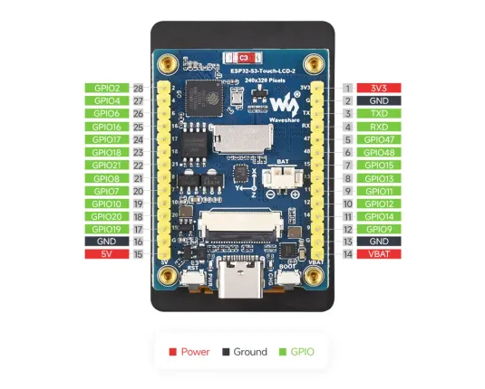
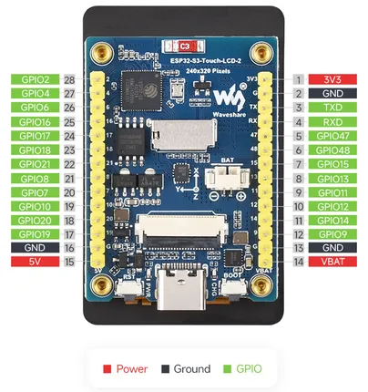

# ESP32-S3-Touch-LCD-2

**Waveshare** · ESP32-S3

Revision: Not identified  
Coverage: Pinout image collected

[Browse all manufacturers](../../../../BROWSE.md) · [Desktop app](https://github.com/valleytechsolutions/black-wire-desktop)

## Pinout

**pinout image** · Reviewed source · JPG

[Open original reference](../../../../library/media/a9d646a71c42052eac29a909d2a98b09a7844716721ebeac88973c731d4d878d.jpg)

**Credit and rights:** Not recorded; retain original attribution. Source/manufacturer: Waveshare.

[Source 1](https://www.waveshare.com/img/devkit/ESP32-S3-Touch-LCD-2/ESP32-S3-Touch-LCD-2-details-inter.jpg) · [Source 2](https://www.waveshare.com/esp32-s3-touch-lcd-2.htm)

SHA-256: `a9d646a71c42052eac29a909d2a98b09a7844716721ebeac88973c731d4d878d`

## Pinout

**pinout image** · Reviewed source · WEBP

[Open original reference](../../../../library/media/8d58533479194c19ba154fc080f6f105cfcc3f7a21cd0e7857938a87ed8267e9.webp)

**Credit and rights:** Not recorded; retain original attribution. Source/manufacturer: Waveshare.

[Source 1](https://docs.waveshare.com/assets/images/ESP32-S3-Touch-LCD-2-details-inter-42ad0de896a5a3095ea813e67ba53a61.webp) · [Source 2](https://docs.waveshare.com/ESP32-S3-Touch-LCD-2)

SHA-256: `8d58533479194c19ba154fc080f6f105cfcc3f7a21cd0e7857938a87ed8267e9`

## Pinout

**pinout image** · Reviewed source · PNG

[Open original reference](../../../../library/media/862fefa2abca98e3b9afba547f6be6fd01bc81aa96d2165b09fd83c6a6012b46.png)

**Credit and rights:** Not recorded; retain original attribution. Source/manufacturer: Waveshare.

[Source 1](https://www.waveshare.com/w/upload/5/5d/ESP32-S3-Touch-LCD-2-details-inter.png) · [Source 2](https://www.waveshare.com/wiki/ESP32-S3-Touch-LCD-2)

SHA-256: `862fefa2abca98e3b9afba547f6be6fd01bc81aa96d2165b09fd83c6a6012b46`

Pin assignments have not been independently electrically verified. Check board revision before wiring.
