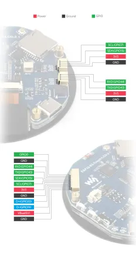

# ESP32-S3-Touch-LCD-2.1

**Waveshare** · ESP32-S3

Revision: Not identified  
Coverage: Pinout image collected

[Browse all manufacturers](../../../../BROWSE.md) · [Desktop app](https://github.com/valleytechsolutions/black-wire-desktop)

## Pinout

**pinout image** · Reviewed source · JPG

[Open original reference](../../../../library/media/1d171eaaee82e461152c70b7b4be2e09a64dc88bd29fd7b9d3619d53802b006f.jpg)

**Credit and rights:** Not recorded; retain original attribution. Source/manufacturer: Waveshare.

[Source 1](https://www.waveshare.com/img/devkit/ESP32-S3-Touch-LCD-2.1/ESP32-S3-Touch-LCD-2.1-details-7.jpg) · [Source 2](https://www.waveshare.com/esp32-s3-touch-lcd-2.1.htm)

SHA-256: `1d171eaaee82e461152c70b7b4be2e09a64dc88bd29fd7b9d3619d53802b006f`

## Pinout

**pinout image** · Reviewed source · WEBP

[Open original reference](../../../../library/media/ecedefddfbecb229010e09320a39cc672bf2a624764c0c5a5a7d81844c561802.webp)

**Credit and rights:** Not recorded; retain original attribution. Source/manufacturer: Waveshare.

[Source 1](https://docs.waveshare.com/assets/images/ESP32-S3-Touch-LCD-2.1-Interface-a320a8256931ce1213f30e0c645fcf22.webp) · [Source 2](https://docs.waveshare.com/ESP32-S3-Touch-LCD-2.1)

SHA-256: `ecedefddfbecb229010e09320a39cc672bf2a624764c0c5a5a7d81844c561802`

## Pinout

**pinout image** · Reviewed source · PNG

[Open original reference](../../../../library/media/35f1a6ab777634321597c2b14e0301c2e5e5a7f8c7e6beb382a6b5c929154d89.png)

**Credit and rights:** Not recorded; retain original attribution. Source/manufacturer: Waveshare.

[Source 1](https://www.waveshare.com/w/upload/a/aa/ESP32-S3-Touch-LCD-2.1-introduction-02.png) · [Source 2](https://www.waveshare.com/wiki/ESP32-S3-Touch-LCD-2.1)

SHA-256: `35f1a6ab777634321597c2b14e0301c2e5e5a7f8c7e6beb382a6b5c929154d89`

Pin assignments have not been independently electrically verified. Check board revision before wiring.
