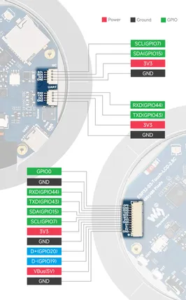

# ESP32-S3-Touch-LCD-2.8C

**Waveshare** · ESP32-S3

Revision: Not identified  
Coverage: Pinout image collected

[Browse all manufacturers](../../../../BROWSE.md) · [Desktop app](https://github.com/valleytechsolutions/black-wire-desktop)

## Pinout

**pinout image** · Reviewed source · JPG

[Open original reference](../../../../library/media/93ff49d174fad1fa56f7df1cfa26b111a04f08b9c2c7c66f010df8b678eb1415.jpg)

**Credit and rights:** Not recorded; retain original attribution. Source/manufacturer: Waveshare.

[Source 1](https://www.waveshare.com/img/devkit/ESP32-S3-Touch-LCD-2.8C/ESP32-S3-Touch-LCD-2.8C-details-7.jpg) · [Source 2](https://www.waveshare.com/esp32-s3-touch-lcd-2.8c.htm)

SHA-256: `93ff49d174fad1fa56f7df1cfa26b111a04f08b9c2c7c66f010df8b678eb1415`

Pin assignments have not been independently electrically verified. Check board revision before wiring.
