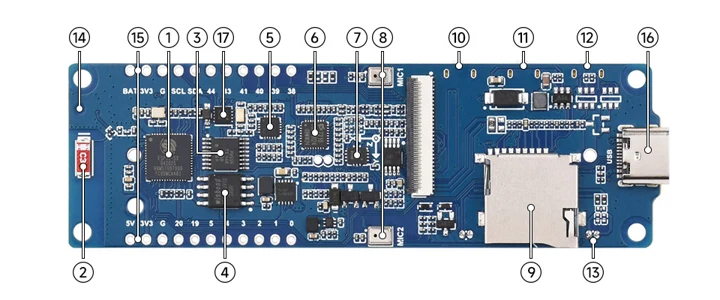
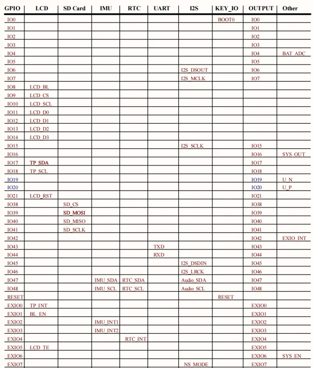

# ESP32-S3-Touch-LCD-3.49

**Waveshare** · ESP32-S3

Revision: Not identified

Coverage: Manufacturer references reviewed by scope; independent electrical and all-connector review pending

[Browse all manufacturers](../../../../BROWSE.md) · [Devices & IoT](../../../../DEVICES.md) · [Open in the browser guide](https://valleytech-black-wire-guide.pages.dev/?board=waveshare-esp32-esp32-s3-touch-lcd-3-49)

## Datasheets and original documentation

Board datasheet: **not yet recorded**. Visual reference: **available**.

[Manufacturer hardware documentation](https://www.waveshare.com/wiki/ESP32-S3-Touch-LCD-3.49)

- **hardware-guide / board**: [Manufacturer pin and hardware documentation](https://www.waveshare.com/wiki/ESP32-S3-Touch-LCD-3.49) · online

A chip datasheet, schematic and board datasheet have different scopes. Match the exact hardware revision.

[Documentation coverage and remaining gaps](../../../../DOCUMENTATION.md)

## Onboard Resources

**board labeling image** · Source identity and visual scope inspected; PDF review covers first-page preview. Independent electrical and all-connector completeness review pending. · JPG

[Open original reference](../../../../library/media/64b1d42dc6b9f3d8f7635e7cc4f480cb7e5dbe6b67be47b1a24f41a030055bcc.jpg)

**Credit and rights:** Manufacturer artwork; reuse and print rights not established. Inclusion does not relicense the original.. Source/manufacturer: Waveshare.

[Source 1](https://www.waveshare.com/w/upload/1/1c/ESP32-S3-Touch-LCD-3.49-details-intro.jpg) · [Source 2](https://www.waveshare.com/wiki/ESP32-S3-Touch-LCD-3.49)

Manufacturer source retained unchanged. Source identity and visual scope inspected; PDF review covers first-page preview. Independent electrical and all-connector completeness review pending. See the linked manufacturer page for the numbered component legend. This is not a complete physical pinout.

Image revision: As supplied in the original; match exact board revision

SHA-256: `64b1d42dc6b9f3d8f7635e7cc4f480cb7e5dbe6b67be47b1a24f41a030055bcc`

## Interfaces

**pin function reference** · Source identity and visual scope inspected; PDF review covers first-page preview. Independent electrical and all-connector completeness review pending. · PNG

[Open original reference](../../../../library/media/d0c36ed7b0814c49f0c5285cb0868e51a01afe44b7e1a98953b286c48ccdb00e.png)

**Credit and rights:** Manufacturer artwork; reuse and print rights not established. Inclusion does not relicense the original.. Source/manufacturer: Waveshare.

[Source 1](https://www.waveshare.com/w/upload/b/b3/ESP32-S3-Touch-LCD-3.49-Hw-list.png) · [Source 2](https://www.waveshare.com/wiki/ESP32-S3-Touch-LCD-3.49)

Manufacturer source retained unchanged. Source identity and visual scope inspected; PDF review covers first-page preview. Independent electrical and all-connector completeness review pending.

Image revision: As supplied in the original; match exact board revision

SHA-256: `d0c36ed7b0814c49f0c5285cb0868e51a01afe44b7e1a98953b286c48ccdb00e`

Pin assignments have not been independently electrically verified. Check board revision before wiring.
