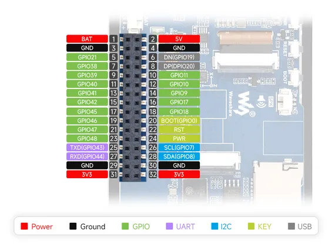
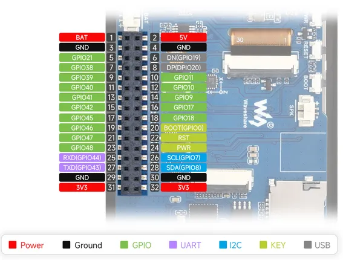
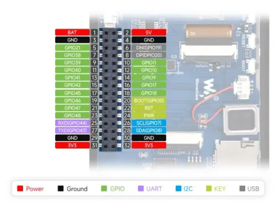

# ESP32-S3-Touch-LCD-3.5

**Waveshare** · ESP32-S3

Revision: Not identified  
Coverage: Pinout image collected

[Browse all manufacturers](../../../../BROWSE.md) · [Desktop app](https://github.com/valleytechsolutions/black-wire-desktop)

## Pinout

**pinout image** · Reviewed source · JPG

[Open original reference](../../../../library/media/c01a41cf397a905d595f7d29fd0bb5ab179eae06d7e0b2a487aa8e3665319211.jpg)

**Credit and rights:** Not recorded; retain original attribution. Source/manufacturer: Waveshare.

[Source 1](https://www.waveshare.com/img/devkit/ESP32-S3-Touch-LCD-3.5/ESP32-S3-Touch-LCD-3.5-details-intro.jpg) · [Source 2](https://www.waveshare.com/esp32-s3-touch-lcd-3.5.htm)

SHA-256: `c01a41cf397a905d595f7d29fd0bb5ab179eae06d7e0b2a487aa8e3665319211`

## Pinout

**pinout image** · Reviewed source · PNG

[Open original reference](../../../../library/media/7860dd9ede0f17a083114551d40682ddd7c845e4f6af3f2a7346c279a420212a.png)

**Credit and rights:** Not recorded; retain original attribution. Source/manufacturer: Waveshare.

[Source 1](https://www.waveshare.com/w/upload/9/94/600px-ESP32-S3-Touch-LCD-3.5-details-intro.png) · [Source 2](https://www.waveshare.com/wiki/ESP32-S3-Touch-LCD-3.5)

SHA-256: `7860dd9ede0f17a083114551d40682ddd7c845e4f6af3f2a7346c279a420212a`

## Pinout

**pinout image** · Reviewed source · WEBP

[Open original reference](../../../../library/media/331ec56cf3a6fc1a0113fdbe697b7622a25e43eab8c68b5547dd563606c0052b.webp)

**Credit and rights:** Not recorded; retain original attribution. Source/manufacturer: Waveshare.

[Source 1](https://docs.waveshare.com/assets/images/ESP32-S3-Touch-LCD-3.5-details-intro-eb9b36264bce6b8cc1ba8c58154ed1ac.webp) · [Source 2](https://docs.waveshare.com/ESP32-S3-Touch-LCD-3.5)

SHA-256: `331ec56cf3a6fc1a0113fdbe697b7622a25e43eab8c68b5547dd563606c0052b`

Pin assignments have not been independently electrically verified. Check board revision before wiring.
