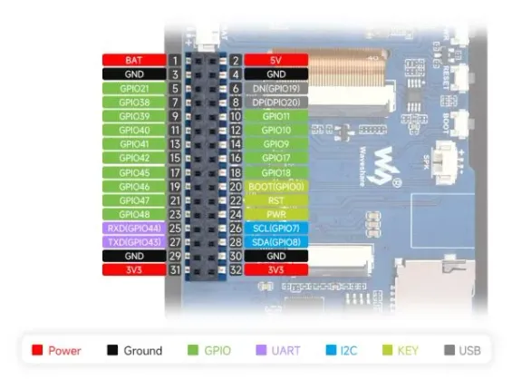

# ESP32-S3-Touch-LCD-3.5B

**Waveshare** · ESP32-S3

Revision: Not identified  
Coverage: Pinout image collected

[Browse all manufacturers](../../../../BROWSE.md) · [Desktop app](https://github.com/valleytechsolutions/black-wire-desktop)

## Pinout

**pinout image** · Reviewed source · JPG

[Open original reference](../../../../library/media/a0102babe339dab503a050c41f399d607544b928b5abd8e4df62b1518001b3b7.jpg)

**Credit and rights:** Not recorded; retain original attribution. Source/manufacturer: Waveshare.

[Source 1](https://www.waveshare.com/img/devkit/ESP32-S3-Touch-LCD-3.5B/ESP32-S3-Touch-LCD-3.5B-details-intro.jpg) · [Source 2](https://www.waveshare.com/esp32-s3-touch-lcd-3.5b.htm)

SHA-256: `a0102babe339dab503a050c41f399d607544b928b5abd8e4df62b1518001b3b7`

## Pinout

**pinout image** · Reviewed source · WEBP

[Open original reference](../../../../library/media/df955418e01aedd7910dd3aeebb82637076ac7cfba65b9d8fe18040cc9c6e748.webp)

**Credit and rights:** Not recorded; retain original attribution. Source/manufacturer: Waveshare.

[Source 1](https://docs.waveshare.com/assets/images/ESP32-S3-Touch-LCD-3.5B-details-intro-3f1de38fd6cce29fc059d18bc651a416.webp) · [Source 2](https://docs.waveshare.com/ESP32-S3-Touch-LCD-3.5B)

SHA-256: `df955418e01aedd7910dd3aeebb82637076ac7cfba65b9d8fe18040cc9c6e748`

## Pinout

**pinout image** · Reviewed source · JPG

[Open original reference](../../../../library/media/6038de2547e930da4b757291afd194bfe509ab9a2eb956a44cfbeabdf55bfb1f.jpg)

**Credit and rights:** Not recorded; retain original attribution. Source/manufacturer: Waveshare.

[Source 1](https://www.waveshare.com/w/upload/6/63/600px-ESP32-S3-Touch-LCD-3.5B-details-intro.jpg) · [Source 2](https://www.waveshare.com/wiki/ESP32-S3-Touch-LCD-3.5B)

SHA-256: `6038de2547e930da4b757291afd194bfe509ab9a2eb956a44cfbeabdf55bfb1f`

Pin assignments have not been independently electrically verified. Check board revision before wiring.
