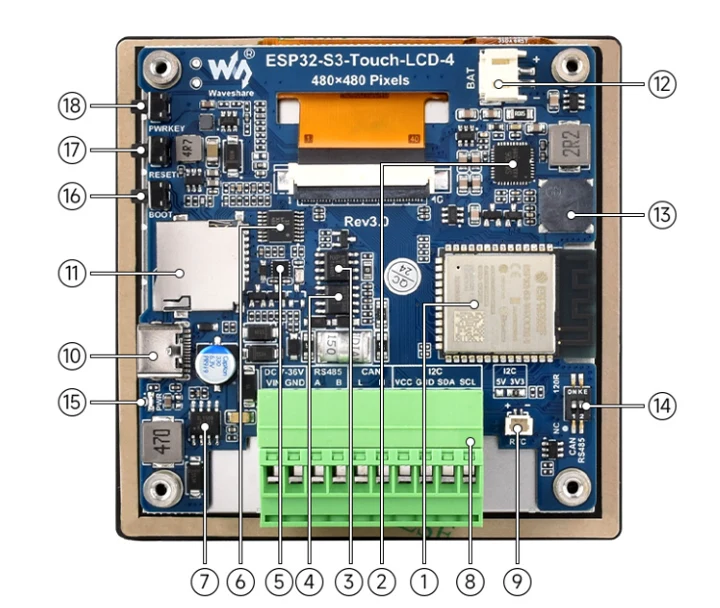
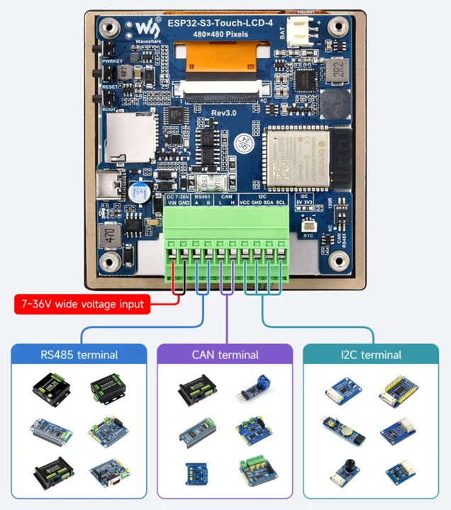
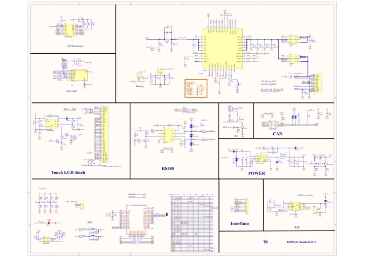
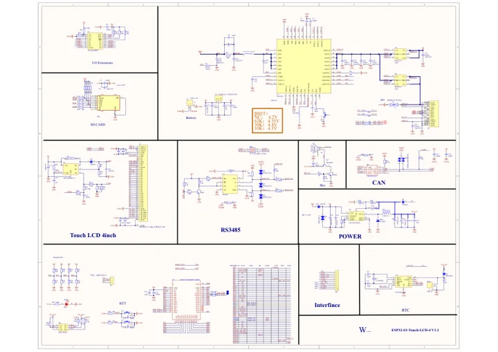
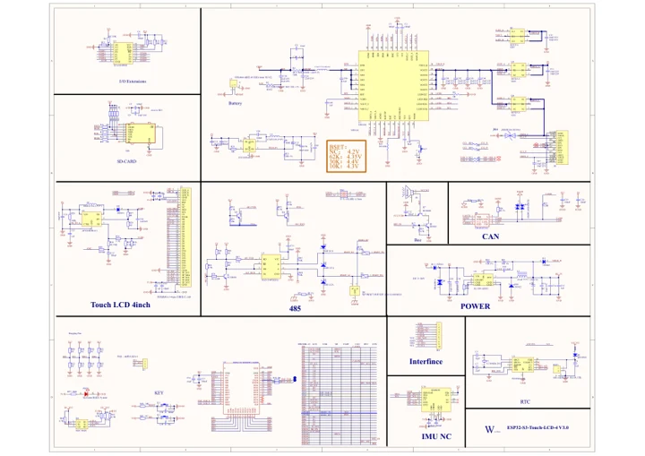
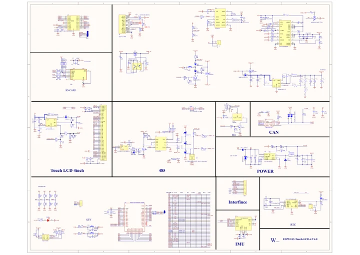

# ESP32-S3-Touch-LCD-4

**Waveshare** · ESP32-S3

Revision: Not identified

Coverage: Manufacturer references reviewed by scope; independent electrical and all-connector review pending

[Browse all manufacturers](../../../../BROWSE.md) · [Devices & IoT](../../../../DEVICES.md) · [Open in the browser guide](https://valleytech-black-wire-guide.pages.dev/?board=waveshare-esp32-esp32-s3-touch-lcd-4)

## Datasheets and original documentation

Board datasheet: **not yet recorded**. Visual reference: **available**.

[Manufacturer hardware documentation](https://www.waveshare.com/wiki/ESP32-S3-Touch-LCD-4)

- **schematic / board**: [ESP32-S3-Touch-LCD-4 Schematic diagram](https://files.waveshare.com/wiki/ESP32-S3-Touch-LCD-4/ESP32-S3-Touch-LCD-4datasheet.pdf) · [saved document](../../../../library/media/ddf6be60520fcc08ba24ce307bc3eabdee843d08a0a05dbf2ff948180098a113.pdf)
- **schematic / board**: [ESP32-S3-Touch-LCD-4-V2 Schematic diagram](https://files.waveshare.com/wiki/ESP32-S3-Touch-LCD-4/ESP32-S3-Touch-LCD-4-V2-Sch.pdf) · [saved document](../../../../library/media/793e8f8d465c8139a8781e314527ea907c608f309b81c57527a8c76c8e8c5fd5.pdf)
- **schematic / board**: [ESP32-S3-Touch-LCD-4-V3 Schematic diagram](https://files.waveshare.com/wiki/ESP32-S3-Touch-LCD-4/ESP32-S3-Touch-LCD-4_V3.0.pdf) · [saved document](../../../../library/media/566bcb29cf9bcb0fb865a061c31fc43d522bb55971bff17e533158b48bcae6c0.pdf)
- **schematic / board**: [ESP32-S3-Touch-LCD-4-V4 Schematic diagram](https://files.waveshare.com/wiki/ESP32-S3-Touch-LCD-4/ESP32-S3-Touch-LCD-4%20V4.0.pdf) · [saved document](../../../../library/media/5971b234f6b23ae66b63996a01da6dc2c9fc1722721ef24621ac8808a88d64a5.pdf)
- **hardware-guide / board**: [Manufacturer pin and hardware documentation](https://www.waveshare.com/wiki/ESP32-S3-Touch-LCD-4) · online

A chip datasheet, schematic and board datasheet have different scopes. Match the exact hardware revision.

[Documentation coverage and remaining gaps](../../../../DOCUMENTATION.md)

## Onboard Resources

**board labeling image** · Source identity and visual scope inspected; PDF review covers first-page preview. Independent electrical and all-connector completeness review pending. · PNG

[Open original reference](../../../../library/media/8ce9b09a7be512089d7f14e916ed208c3a3d2a6f7fa6b66726e0aec3a5b2b0bf.png)

**Credit and rights:** Manufacturer artwork; reuse and print rights not established. Inclusion does not relicense the original.. Source/manufacturer: Waveshare.

[Source 1](https://www.waveshare.com/w/upload/6/62/700px-ESP32-S3-Touch-LCD-4-introduction-01.png) · [Source 2](https://www.waveshare.com/wiki/ESP32-S3-Touch-LCD-4)

Manufacturer source retained unchanged. Source identity and visual scope inspected; PDF review covers first-page preview. Independent electrical and all-connector completeness review pending. See the linked manufacturer page for the numbered component legend. This is not a complete physical pinout.

Image revision: As supplied in the original; match exact board revision

SHA-256: `8ce9b09a7be512089d7f14e916ed208c3a3d2a6f7fa6b66726e0aec3a5b2b0bf`

## Interfaces

**connector reference** · Source identity and visual scope inspected; PDF review covers first-page preview. Independent electrical and all-connector completeness review pending. · PNG

[Open original reference](../../../../library/media/c3d49d030bc42eca3e0bd2a5bf15bcdde852f51564743d57b0e18062aefd0069.png)

**Credit and rights:** Manufacturer artwork; reuse and print rights not established. Inclusion does not relicense the original.. Source/manufacturer: Waveshare.

[Source 1](https://www.waveshare.com/w/upload/3/3e/700px-ESP32-S3-Touch-LCD-4-details-5.png) · [Source 2](https://www.waveshare.com/wiki/ESP32-S3-Touch-LCD-4)

Manufacturer source retained unchanged. Source identity and visual scope inspected; PDF review covers first-page preview. Independent electrical and all-connector completeness review pending.

Image revision: As supplied in the original; match exact board revision

SHA-256: `c3d49d030bc42eca3e0bd2a5bf15bcdde852f51564743d57b0e18062aefd0069`

## ESP32-S3-Touch-LCD-4 Schematic diagram

**original reference PDF** · Source identity and visual scope inspected; PDF review covers first-page preview. Independent electrical and all-connector completeness review pending. · PDF

[Open original reference](../../../../library/media/ddf6be60520fcc08ba24ce307bc3eabdee843d08a0a05dbf2ff948180098a113.pdf)

**Credit and rights:** Manufacturer artwork; reuse and print rights not established. Inclusion does not relicense the original.. Source/manufacturer: Waveshare.

[Source 1](https://files.waveshare.com/wiki/ESP32-S3-Touch-LCD-4/ESP32-S3-Touch-LCD-4datasheet.pdf) · [Source 2](https://www.waveshare.com/wiki/ESP32-S3-Touch-LCD-4)

Manufacturer source retained unchanged. Source identity and visual scope inspected; PDF review covers first-page preview. Independent electrical and all-connector completeness review pending.

Image revision: As supplied in the original; match exact board revision

SHA-256: `ddf6be60520fcc08ba24ce307bc3eabdee843d08a0a05dbf2ff948180098a113`

## ESP32-S3-Touch-LCD-4-V2 Schematic diagram

**original reference PDF** · Source identity and visual scope inspected; PDF review covers first-page preview. Independent electrical and all-connector completeness review pending. · PDF

[Open original reference](../../../../library/media/793e8f8d465c8139a8781e314527ea907c608f309b81c57527a8c76c8e8c5fd5.pdf)

**Credit and rights:** Manufacturer artwork; reuse and print rights not established. Inclusion does not relicense the original.. Source/manufacturer: Waveshare.

[Source 1](https://files.waveshare.com/wiki/ESP32-S3-Touch-LCD-4/ESP32-S3-Touch-LCD-4-V2-Sch.pdf) · [Source 2](https://www.waveshare.com/wiki/ESP32-S3-Touch-LCD-4)

Manufacturer source retained unchanged. Source identity and visual scope inspected; PDF review covers first-page preview. Independent electrical and all-connector completeness review pending.

Image revision: As supplied in the original; match exact board revision

SHA-256: `793e8f8d465c8139a8781e314527ea907c608f309b81c57527a8c76c8e8c5fd5`

## ESP32-S3-Touch-LCD-4-V3 Schematic diagram

**original reference PDF** · Source identity and visual scope inspected; PDF review covers first-page preview. Independent electrical and all-connector completeness review pending. · PDF

[Open original reference](../../../../library/media/566bcb29cf9bcb0fb865a061c31fc43d522bb55971bff17e533158b48bcae6c0.pdf)

**Credit and rights:** Manufacturer artwork; reuse and print rights not established. Inclusion does not relicense the original.. Source/manufacturer: Waveshare.

[Source 1](https://files.waveshare.com/wiki/ESP32-S3-Touch-LCD-4/ESP32-S3-Touch-LCD-4_V3.0.pdf) · [Source 2](https://www.waveshare.com/wiki/ESP32-S3-Touch-LCD-4)

Manufacturer source retained unchanged. Source identity and visual scope inspected; PDF review covers first-page preview. Independent electrical and all-connector completeness review pending.

Image revision: As supplied in the original; match exact board revision

SHA-256: `566bcb29cf9bcb0fb865a061c31fc43d522bb55971bff17e533158b48bcae6c0`

## ESP32-S3-Touch-LCD-4-V4 Schematic diagram

**original reference PDF** · Source identity and visual scope inspected; PDF review covers first-page preview. Independent electrical and all-connector completeness review pending. · PDF

[Open original reference](../../../../library/media/5971b234f6b23ae66b63996a01da6dc2c9fc1722721ef24621ac8808a88d64a5.pdf)

**Credit and rights:** Manufacturer artwork; reuse and print rights not established. Inclusion does not relicense the original.. Source/manufacturer: Waveshare.

[Source 1](https://files.waveshare.com/wiki/ESP32-S3-Touch-LCD-4/ESP32-S3-Touch-LCD-4%20V4.0.pdf) · [Source 2](https://www.waveshare.com/wiki/ESP32-S3-Touch-LCD-4)

Manufacturer source retained unchanged. Source identity and visual scope inspected; PDF review covers first-page preview. Independent electrical and all-connector completeness review pending.

Image revision: As supplied in the original; match exact board revision

SHA-256: `5971b234f6b23ae66b63996a01da6dc2c9fc1722721ef24621ac8808a88d64a5`

Pin assignments have not been independently electrically verified. Check board revision before wiring.
