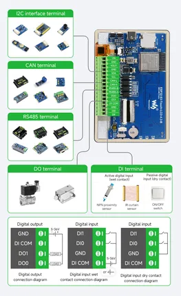
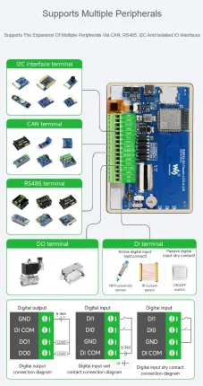

# ESP32-S3-Touch-LCD-4.3B

**Waveshare** · ESP32-S3

Revision: Not identified  
Coverage: Pinout image collected

[Browse all manufacturers](../../../../BROWSE.md) · [Desktop app](https://github.com/valleytechsolutions/black-wire-desktop)

## Pinout

**pinout image** · Reviewed source · JPG

[Open original reference](../../../../library/media/69caee206478ff98c88ad5435e54bf3a27a50df60ba84d8d791d10d607043030.jpg)

**Credit and rights:** Not recorded; retain original attribution. Source/manufacturer: Waveshare.

[Source 1](https://www.waveshare.com/img/devkit/ESP32-S3-Touch-LCD-4.3B/ESP32-S3-Touch-LCD-4.3B-details-9.jpg) · [Source 2](https://www.waveshare.com/esp32-s3-touch-lcd-4.3b.htm)

SHA-256: `69caee206478ff98c88ad5435e54bf3a27a50df60ba84d8d791d10d607043030`

## Pinout

**pinout image** · Reviewed source · WEBP

[Open original reference](../../../../library/media/6b6d207e8ddd4c384ee1eb180559c5ac3202eeee1db81436eae71188b151c402.webp)

**Credit and rights:** Not recorded; retain original attribution. Source/manufacturer: Waveshare.

[Source 1](https://docs.waveshare.com/assets/images/ESP32-S3-Touch-4.3B-details-0edde12d537b5974670d2bb83e8ff254.webp) · [Source 2](https://docs.waveshare.com/ESP32-S3-Touch-LCD-4.3B)

SHA-256: `6b6d207e8ddd4c384ee1eb180559c5ac3202eeee1db81436eae71188b151c402`

Pin assignments have not been independently electrically verified. Check board revision before wiring.
