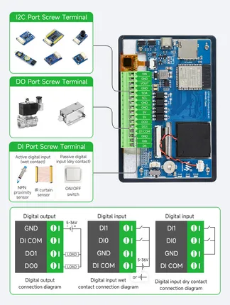

# ESP32-S3-Touch-LCD-4.3C

**Waveshare** · ESP32-S3

Revision: Not identified  
Coverage: Pinout image collected

[Browse all manufacturers](../../../../BROWSE.md) · [Desktop app](https://github.com/valleytechsolutions/black-wire-desktop)

## Pinout

**pinout image** · Reviewed source · JPG

[Open original reference](../../../../library/media/15483e5cbcc67750f613c670aede9862de4b458dc4986f00b355b65af74c1d5d.jpg)

**Credit and rights:** Not recorded; retain original attribution. Source/manufacturer: Waveshare.

[Source 1](https://www.waveshare.com/img/devkit/ESP32-S3-Touch-LCD-4.3C/ESP32-S3-Touch-LCD-4.3C-details-13.jpg) · [Source 2](https://www.waveshare.com/esp32-s3-touch-lcd-4.3c.htm)

SHA-256: `15483e5cbcc67750f613c670aede9862de4b458dc4986f00b355b65af74c1d5d`

Pin assignments have not been independently electrically verified. Check board revision before wiring.
