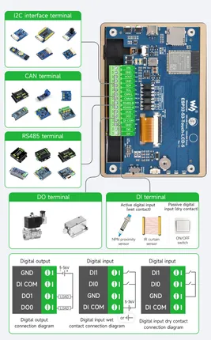
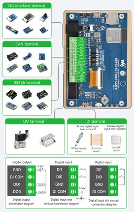
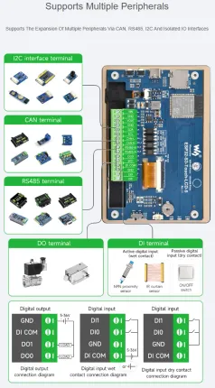

# ESP32-S3-Touch-LCD-5

**Waveshare** · ESP32-S3

Revision: Not identified  
Coverage: Pinout image collected

[Browse all manufacturers](../../../../BROWSE.md) · [Desktop app](https://github.com/valleytechsolutions/black-wire-desktop)

## Pinout

**pinout image** · Reviewed source · JPG

[Open original reference](../../../../library/media/9b27e071c9740598d9439c96bc04c611c39615577d086b6d232af0dcd1c80a0d.jpg)

**Credit and rights:** Not recorded; retain original attribution. Source/manufacturer: Waveshare.

[Source 1](https://www.waveshare.com/img/devkit/ESP32-S3-Touch-LCD-5/ESP32-S3-Touch-LCD-5-details-9.jpg) · [Source 2](https://www.waveshare.com/esp32-s3-touch-lcd-5.htm)

SHA-256: `9b27e071c9740598d9439c96bc04c611c39615577d086b6d232af0dcd1c80a0d`

## Pinout

**pinout image** · Reviewed source · PNG

[Open original reference](../../../../library/media/fdb3fd0f39e65927a8712ca2804e43564549d5fd045fb4d838bee6e190cd33b5.png)

**Credit and rights:** Not recorded; retain original attribution. Source/manufacturer: Waveshare.

[Source 1](https://www.waveshare.com/w/upload/2/21/700px-ESP32-S3-Touch-LCD-5-details-9.png) · [Source 2](https://www.waveshare.com/wiki/ESP32-S3-Touch-LCD-5)

SHA-256: `fdb3fd0f39e65927a8712ca2804e43564549d5fd045fb4d838bee6e190cd33b5`

## Pinout

**pinout image** · Reviewed source · WEBP

[Open original reference](../../../../library/media/e9eb7eec5b18911df8f09dcb24eb77df2b84172a386acb1ae4ca71fa1840c211.webp)

**Credit and rights:** Not recorded; retain original attribution. Source/manufacturer: Waveshare.

[Source 1](https://docs.waveshare.com/assets/images/ESP32-S3-Touch-LCD-5-details-9-f93db57f041919589aefd349f77a2605.webp) · [Source 2](https://docs.waveshare.com/ESP32-S3-Touch-LCD-5)

SHA-256: `e9eb7eec5b18911df8f09dcb24eb77df2b84172a386acb1ae4ca71fa1840c211`

Pin assignments have not been independently electrically verified. Check board revision before wiring.
